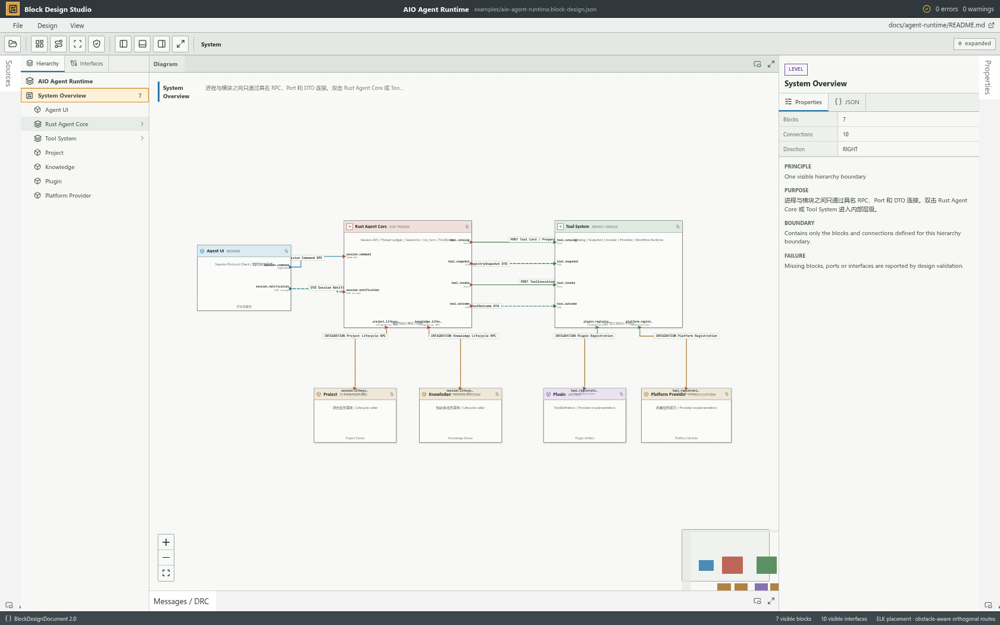
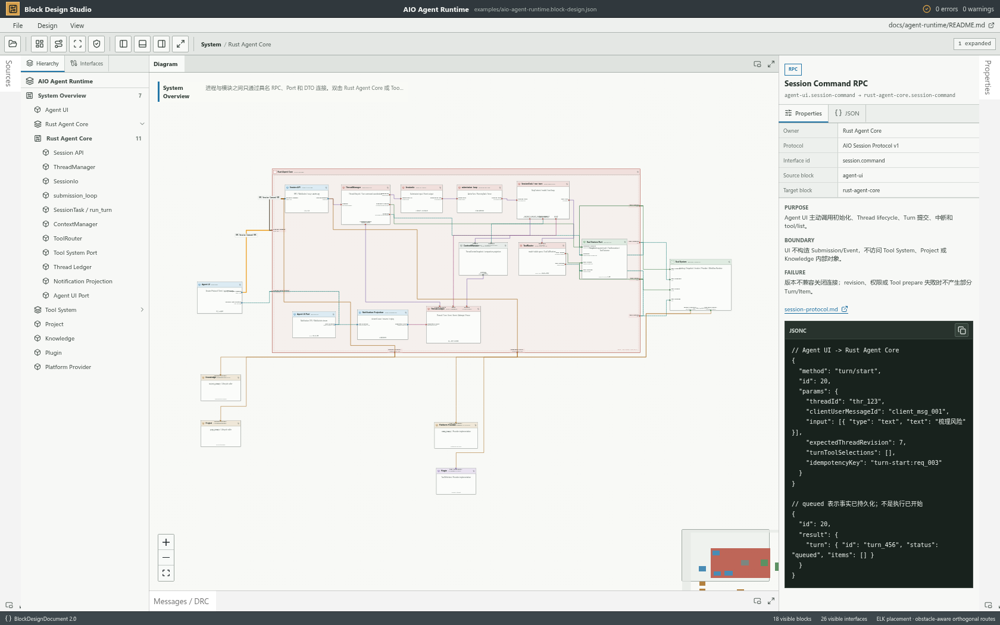
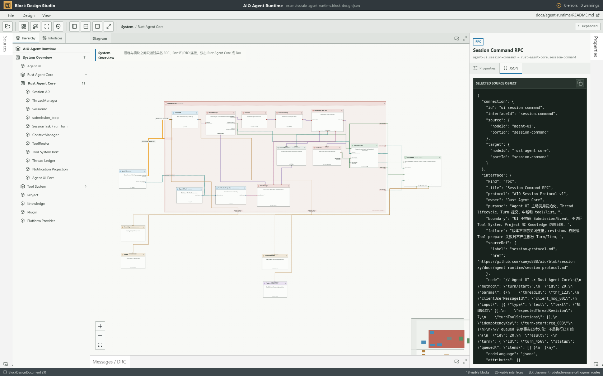
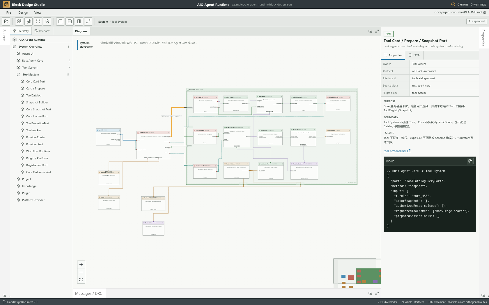

# Architecture Block Studio

Architecture Block Studio is a reusable, local-first architecture editor for hierarchical software and protocol diagrams. It presents modules as blocks, public interfaces as boundary ports, and concrete protocol DTOs as typed connections. Authors create and move modules, define ports and contracts, connect boundaries, expand child designs, validate the result, and save a portable `BlockDesignDocument` JSON file.

The first bundled design is the AIO Agent Runtime architecture. The studio itself has no AIO runtime dependency and can load any document that satisfies the public `BlockDesignDocument` schema.

## Module Contract

| Module | Principle | Public contract | Boundary and failure behavior |
| --- | --- | --- | --- |
| `model` | Own the document shape and semantic design rules | `parseBlockDesignDocument`, `validateBlockDesignDocument` | Does not render or lay out. Invalid structure is rejected; semantic issues remain explicit DRC messages. |
| `editor` | Own atomic document transformations, undo/redo history and dirty state | `DesignOperation`, `applyDesignOperation`, `useDesignEditor` | Does not render, route or persist. A structurally invalid operation is rejected without partially changing the installed document. |
| `layout` | Compose expanded hierarchy, place compound blocks, and produce render nodes | `layoutBlockDesign` | Does not interpret business meaning or mutate the source document. Placement failure is surfaced to the studio. |
| `routing` | Derive one obstacle-avoiding orthogonal route from visible nodes and ports | `absoluteRoutingObstacles`, `routeOrthogonalInterface` | Does not reposition blocks or rewrite connections. Endpoints are excluded from obstacles; every unrelated visible block remains an obstacle. |
| `io` | Translate between local/remote JSON and one validated document, and serialize downloads | `loadDesignFromFile`, `loadDesignFromUrl`, `downloadDesign` | Does not own architecture facts or editor history. Load failures retain the current document; export does not clear dirty state. |
| `studio` | Compose editor, IO, canvas, Inspector, selection, expanded levels and workspace state | `BlockDesignStudio` | Does not implement document mutations inside UI components. Command failures remain visible and do not install partial state. |

```text
Canvas gestures / Inspector forms / toolbar commands
                         |
                         v
               named DesignOperation
                         |
                         v
          editor history + atomic validation
                         |
                         v
               BlockDesignDocument
                  /             \
                 v               v
      model DRC + projections   IO serialize/download
                 |
                 v
       layout -> routing -> React Flow
                 |
                 v
    sources / inspector / messages panels
```

The document is the only design-content source. React nodes, edges, hierarchy entries, Inspector JSON and DRC messages are all derived from it. An authored module move writes `node.layout.position` through one editor operation. Dock width, collapsed panels, expanded hierarchy, selection, zoom, automatic placement and generated route geometry are workspace state; they are never written back as protocol or architecture facts.

### Geometry invariants

- A route starts and ends only at the named endpoint ports.
- A route never enters the bounding box of a non-endpoint block or an unrelated hierarchy container.
- A cross-hierarchy route passes through the parent port declared by `hierarchy.portBindings`; names and interface ids are never used to guess containment.
- Regenerate Layout may change block placement and routing. Optimize Routing preserves block placement and changes only derived routes.
- Connections do not render a label on the route. Endpoint port labels identify the visible path; selecting any route reveals its connection name and complete interface contract in the Inspector.

## Screenshots

| Local editor and selected interface | Expanded hierarchy routing |
| --- | --- |
|  |  |

| System overview | Clickable Core interface |
| --- | --- |
|  |  |

| Raw interface JSON | Tool System hierarchy |
| --- | --- |
|  |  |

## Document Shape

```jsonc
{
  "schemaVersion": "2.0",
  "id": "example.system",
  "title": "Example System",
  "summary": "A minimal two-block design.",
  "entryLevelId": "system",
  "interfaceDefinitions": {
    "session.command": {
      "kind": "rpc",
      "title": "Session Command RPC",
      "owner": "Core",
      "purpose": "Submit a user command.",
      "boundary": "The UI cannot mutate Core state directly.",
      "failure": "Invalid commands are rejected atomically.",
      "sourceRef": { "label": "Protocol", "href": "./protocol.md" },
      "code": "{ \"method\": \"turn/start\", \"params\": {} }"
    }
  },
  "levels": [
    {
      "id": "system",
      "title": "System",
      "nodes": [
        {
          "id": "ui",
          "title": "UI",
          "inspector": {
            "purpose": "Submit commands.",
            "boundary": "Owns display state only.",
            "failure": "Rejected commands remain visible to the user."
          },
          "ports": [
            { "id": "command", "label": "command", "side": "right", "direction": "output" }
          ]
        },
        {
          "id": "core",
          "title": "Core",
          "hierarchy": {
            "childLevelId": "core-internals",
            "portBindings": [
              {
                "parentPortId": "command",
                "childEndpoint": { "nodeId": "session-api", "portId": "external-command" }
              }
            ]
          },
          "inspector": {
            "purpose": "Own and execute the session.",
            "boundary": "Receives commands only through named ports.",
            "failure": "Invalid commands do not mutate persisted state."
          },
          "ports": [
            { "id": "command", "label": "command", "side": "left", "direction": "input" }
          ]
        }
      ],
      "connections": [
        {
          "id": "ui-to-core",
          "interfaceId": "session.command",
          "source": { "nodeId": "ui", "portId": "command" },
          "target": { "nodeId": "core", "portId": "command" }
        }
      ]
    },
    {
      "id": "core-internals",
      "parentLevelId": "system",
      "title": "Core internals",
      "nodes": [
        {
          "id": "session-api",
          "title": "Session API",
          "ports": [
            { "id": "external-command", "label": "command", "side": "left", "direction": "input" }
          ],
          "inspector": {
            "purpose": "Receive the public command.",
            "boundary": "Does not expose mutable Core state.",
            "failure": "Invalid commands are rejected before dispatch."
          }
        }
      ],
      "connections": []
    }
  ]
}
```

Hierarchical nodes use `hierarchy.childLevelId` and must bind every parent port to one explicit child endpoint through `hierarchy.portBindings`. The parent port owns the cross-boundary direction; the child endpoint may be either an implementation port or an explicit boundary-adapter port. Position is optional: ELK computes a layered placement from ports and connections. In the collapsed authored view, `node.layout.position` provides deliberate initial placement; expanding a hierarchy or choosing Regenerate Layout recomputes compound placement with ELK.

The executable schema is [`src/model/design.ts`](src/model/design.ts). Structural parsing is strict about required protocol objects and supplies documented defaults for optional visual fields. Semantic DRC rules live separately in [`src/model/validation.ts`](src/model/validation.ts).

## Editing Designs

- Create a blank design with **File → New Design**.
- Add modules to the selected hierarchy level, then move them on the authored canvas.
- Add input, output or bidirectional ports to the selected module.
- Drag from one compatible port to another and define the connection id, interface id, interface kind and Owner before the connection is committed.
- Create a child design for a module, add its internal modules and ports, then bind every parent port to one explicit child endpoint in the parent module Inspector.
- Edit document, level, module, port and interface properties in the Inspector. Module and interface contracts expose Principle, Purpose, Boundary and Failure behavior.
- Delete selected modules, ports or connections with an explicit confirmation. Cascaded changes remain recoverable through Undo.
- Use **Undo/Redo** or `Ctrl/Cmd+Z`, `Ctrl/Cmd+Shift+Z` and `Ctrl/Cmd+Y`. Use `Ctrl/Cmd+S` to save and `Ctrl/Cmd+Shift+S` for Save As.

Every authoring action is one named editor operation. Undo and redo replace the complete validated document snapshot; they never reconstruct facts from React Flow state. Semantic incompleteness, such as an unbound hierarchy port or an unfinished contract, remains visible in DRC while the document is being authored.

## Loading Designs

- Start with the bundled AIO example.
- Open a local `.json` document from the toolbar.
- Load an HTTP(S) JSON document from the toolbar.
- Add `?design=<encoded-url>` to deep-link a remote or same-origin document.
- Embed `BlockDesignStudio` and provide an already parsed JavaScript object.

**Save** downloads the current local document using its active file name and marks that exact snapshot as saved. **Save As** asks for a new file name before downloading and updates the active name. **Export JSON** downloads a copy without changing dirty state. Opening or creating another document while dirty requires explicit discard confirmation.

Loading is transactional: the current design remains installed until the new document passes structural parsing. Semantic DRC errors are displayed and cross-probe to the affected block or connection.

## Development

```bash
pnpm install
pnpm exec playwright install chromium
pnpm dev --host 127.0.0.1 --port 4317
pnpm typecheck
pnpm build
pnpm test
```

Open `http://127.0.0.1:4317`. The project is self-contained under this directory and can be extracted into its own repository; the AIO JSON document is example content, not a runtime dependency.

## Design References

- [AMD Vivado IP Integrator: Designing with IP Integrator](https://docs.amd.com/r/2022.1-English/ug994-vivado-ip-subsystems/Designing-with-IP-Integrator)
- [React Flow](https://reactflow.dev/learn)
- [Eclipse Layout Kernel layered layout](https://eclipse.dev/elk/reference/algorithms/org-eclipse-elk-layered.html)

React Flow is used for interaction and viewport behavior. ELK computes compound block placement. React Flow Smart Edge provides grid-based obstacle-aware orthogonal routing; Architecture Block Studio supplies React Flow's absolute compound-node geometry so nested routes cannot cross unrelated blocks. Dockview provides resizable, collapsible, maximizable and movable IDE panels. Architecture Block Studio owns its document model, visual language, validation and application shell. Dependency license details are listed in [THIRD_PARTY_NOTICES.md](THIRD_PARTY_NOTICES.md).

## License

MIT. See [LICENSE](LICENSE).
