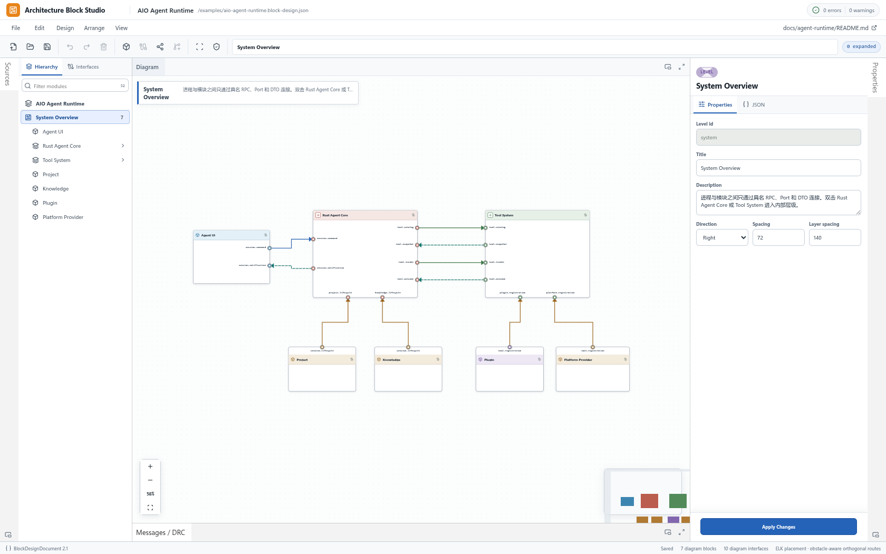

# Architecture Block Studio

> 面向 AI 编程时代的代码模块与接口设计工作台：设计系统、理解代码、审查架构。

Architecture Block Studio 把代码系统表达成可编辑、可校验、可版本化的模块设计。模块说明谁拥有职责，端口说明公开能力，连线说明类型化接口，层级说明内部结构；所有设计事实最终落在一份 `BlockDesignDocument` JSON 中。

它不只是“生成代码前画一张图”。它同时服务于三件事：

- **设计**：在实现前明确 Owner、职责边界、接口方向与失败行为，为人和 AI 提供稳定约束。
- **理解**：把已有代码或外部分析结果映射成模块、端口和依赖关系，从整体上读懂系统。
- **审查**：在代码变更后检查职责漂移、隐式依赖、越界调用与接口合同变化，补足逐行 Code Review 的结构视角。



## 为什么是现在

AI 让代码生成越来越快，也让结构退化越来越容易：同一职责被重复实现、调用关系藏进细节、模块边界在多轮修改中漂移。代码产量不再稀缺之后，真正稀缺的是人能否持续回答：

- 这项事实和状态由谁拥有？
- 模块为什么存在，又明确不负责什么？
- 模块之间只能通过哪些接口组合？
- AI 生成或修改的代码，是否仍遵守既定边界和依赖方向？

Architecture Block Studio 将这些问题变成可阅读、可编辑、可校验的设计对象，让架构意图能够进入版本控制，也能成为 AI 编程上下文和人工审查依据。

## 核心能力

- 像专业 IDE 一样新建、打开、编辑、保存、另存和导出设计。
- 创建模块、具名端口、RPC / DTO / Event / Stream 等类型化接口。
- 既可以在画布拖线，也可以通过 **Add Interface** 用键盘选择端点并创建同一类接口合同。
- 为模块和接口记录 Principle、Purpose、Boundary、Failure 与 Owner。
- 原位展开子设计，显式绑定父子端口，同时保留系统上下文。
- 在 Hierarchy 中按模块标题、id、Owner 或 Level 搜索，并直接定位画布与 Inspector。
- 选中模块即可查看直接入站 / 出站接口与对端，点击摘要进入完整接口合同。
- 使用 DRC 检查结构、引用、方向、必连端口和合同完整性，并直接查看修正方向。
- 使用 ELK 生成分层布局；自动连线由场景级正交多连接策略统一规划，以障碍净空、端口方向、真实 lane 间距、有限绕行和确定性证书保持复杂设计可读；无法消除的正交交叉用克制的线桥表达前后关系。
- 缩放到系统总览时只保留模块标题、端口名和线路，放大后自动恢复 Owner、摘要、类型等完整细节。
- 选中模块即可从四边或四角调整尺寸；端口和线路实时跟随，结果进入同一份 JSON、Undo / Redo 与保存链。
- 拖动尺寸抓手时按住 **Shift** 保持模块原始宽高比例；比例约束优先于兄弟尺寸吸附，松手仍只产生一次可撤销几何编辑。
- 移动或调整模块时自动显示边缘、中心与同宽 / 同高辅助线；先从模块或尺寸抓手开始直接操作，再按住 **Alt** 可临时关闭当前手势的吸附，画布不会擅自跳回全图视角。Alt 若在 pointerdown 前已经按住，则明确表示强制框选，两种能力不会抢占。
- 使用普通点击、Shift / Ctrl / Cmd 与左键框选建立多选；普通框选只选择完全包围的对象，按住 **Alt** 可从模块或抓手上直接起框并选择所有真实相交的模块与线段，**Alt + Shift** 可成片移出已有选择。成组移动、六向对齐与水平 / 垂直等距分布都只产生一次可撤销操作。
- 使用 **Ctrl/⌘ A** 一次选择当前 Level 的全部模块和接口，使用 **Ctrl/⌘ Shift A** 清空选择；输入框继续保留浏览器原生全选，不会误选画布对象。
- 画布获得焦点后，使用 **Tab / Shift + Tab** 按稳定顺序遍历可见模块与接口，使用 **Alt + Tab** 返回可见父模块；按 **Enter** 进入所选模块的端口或所选线路的抓手，按 **Esc** 返回对象。侧栏表单继续使用原生 Tab，不会被画布抢走焦点。
- 选中任意接口后使用 **Ctrl/⌘ Shift H** 或 **View → Fit Selection**，可把完整正交路径和两端模块一起聚焦到可读范围，便于逐线人工审查。
- 使用 **Ctrl/⌘ + / −**、View 菜单或画布左下控件缩放；百分比始终显示真实 viewport zoom，点击即可回到 **Actual Size (100%)**，不会改变设计尺寸或导出结果。
- 左键空白拖动执行完整包围框选，**Alt + 左拖**执行几何相交框选；按住 **Space** 后左拖、直接右拖或中拖平移；普通滚轮平移，Ctrl/⌘ + wheel 围绕指针缩放。Space 模式有临时状态提示，放开即回到选择，不改变任何设计事实。
- 使用 **Ctrl/⌘ C、Ctrl/⌘ V、Ctrl/⌘ D** 或 Edit 菜单复制、粘贴和 Duplicate 同层模块子图；内部接口、接口合同和完整子设计一起复制，外部连接明确排除，一次 Undo 即可恢复。
- 选中一个或多个同层模块后按住 **Ctrl/⌘ 拖动**，可在指针落点直接克隆完整子图；原模块只作拖动预览，新模块、内部接口与后代 Level 作为一次原子编辑提交。
- 选中连线后拖动正交线段，手动路由随 JSON 保存，也可随时恢复自动布线。
- 从端口拉线或拖动既有线路端点时，画布会实时标出起点、合法候选与非法目标，并显示端口法向的正交预览；按 **Esc**、移出画布或落到非法端口都会完整取消，不改 JSON、不污染 Undo / Redo。
- 选中接口后可从 **Design、命令面板或 Inspector** 打开 `Reconnect Interface`，仅用键盘重新选择源 / 目标端口；端点未变化时不会产生历史，真正变化后会清除旧端点拥有的手工路线，并完整进入 Undo / Redo 与保存链。
- 画布不显示线中标签；端口承担局部识别，点击连线后由 Inspector 展示完整合同。
- 通过 Undo / Redo、事务性加载和 dirty 状态保护编辑过程。


卡片尺寸不是画布临时效果。拖动四边 / 四角或使用 **Ctrl/⌘ + Shift + 方向键** 调整后，位置、宽高、端口和线路作为一组原子几何保存；内容安全下限会避免端口文字被压坏。


拖动模块接近同级模块的边缘或中心时，画布会用克制的洋红参考线提示吸附；调整尺寸接近同宽 / 同高时显示成对尺寸括号。辅助线只在当前操作中出现，不进入 JSON，也不会成为需要维护的第二份布局状态。


复制不是把画面像素拍成一张图。Studio 会从当前选择构造可校验的设计片段，重写模块、连接、接口定义和子 Level 的全部引用，再把整组放到最近的无碰撞网格位置。系统剪贴板不可用时仍可在当前工作台继续粘贴，并给出可见反馈。


Ctrl/⌘ 拖动复用同一份可校验片段合同，但由指针明确给出目标位移；画布松手后立即恢复原模块投影，Editor 只插入一次完整子图。因此克隆不会丢失内部接口或子 Level，也不会出现原图被移动、JSON 却另存一套位置的双状态。


当前 Level 的全选与清空选择沿用同一选择协议，因此 Canvas、Sources、Inspector、菜单、快捷键和命令面板看到的是同一组对象；选择本身不会改变 JSON、历史或用户正在观察的视口。


相交框选不是用折线外接矩形猜测命中。模块按实际渲染边界判断，接口按每一段真实正交路径判断，因此不会把 L 形线路中间的空白区域误当成线路；结果仍只转换成同一份工作区选择，不写入设计 JSON。


当模块、容器或线路在同一点重叠时，按住 Alt 单击即可按真实视觉层级逐项选择下方对象；当前选择本身就是循环游标，不另存隐藏状态。拖动超过阈值仍是上面的相交框选，Shift / Ctrl / ⌘ 只切换最上层命中对象。


键盘遍历与鼠标选择使用同一份对象顺序和 `SelectionRef`，不会让 React Flow 的 DOM 焦点另建一套“看似选中”。画布对外只有一个 Tab 入口；内部模块、接口、端口和路线抓手由画布统一协调，Tab / Shift + Tab 可遍历同一对象的全部控件，从最后一项继续前进才会离开 Canvas，因此进入 Properties 时仍保留正在审查的连接上下文。


接口聚焦不是只放大某个端口。画布会合并选中线路的全部折点、两端模块矩形和必要留白，再执行一次可中断的 viewport 导航；线路方向、手动 waypoint、selection 和设计坐标保持不变。


缩放入口不各自维护比例。工具按钮、百分比、View 菜单、命令面板和键盘都发出同一类 viewport 请求，由 Canvas 的导航协调器执行；用户开始直接操作时仍可立即中断动画。


即使模块或连线已经获得键盘焦点，Space 也不会再被选择处理截断；按住后可直接平移审查上下文，选中线路和 Inspector 保持不变。


选中连线后，画布显示可拖动的正交线段把手，Inspector 同步显示手动路由状态和恢复自动布线入口。


鼠标创建和改接接口使用同一套候选资格。拖动时只有合法端口获得明确提示，预览保持正交且不提前画语义箭头；成功后才由正式连接的 target 表达方向。取消、非法目标和原端点落点都会恢复原设计，并给出不遮挡图形的短反馈。


预览不是一条只顾首尾的装饰折线。拖动经过复杂画布时，它会读取与正式路由相同的模块障碍、端口锚点和层级边界，实时寻找一条可验证的单线通路；无解时明确提示，不用穿卡片的直线掩盖问题。端口吸附后的预览点集与松手提交后的正式单线几何一致，而 JSON 仍只保存模块、端口、接口和用户确认的手动折点。


端点重连不是键盘入口另造的一套连接规则。Dialog 只持有临时选择，合法端口仍由 model 统一给出，鼠标拖拽和键盘确认最终都只提交一次 `connection/reconnect`；完成后焦点回到同一接口的 Inspector，设计者可以连续审查。


在既有复杂设计中继续新增模块和接口时，线路仍从正确端口侧进出，并避开其他模块；自动路径可直接选中，再用鼠标或方向键调整，最终随同一份 JSON 保存。


路由质量使用五层合同持续检查：逐条线、全部无序线对、稀疏到单模块 100+ 连接的偏斜密度、移动 / 调整 / 展开 / 手动布线 / 实时拖线状态，以及 Chromium / Firefox 真实渲染。真实 UI 场景会同时展开五层边界并审计全部 20 条可见线与 190 组线对；偏斜压力场景中的 100 条连接与 4950 组线对也全部审计，不靠抽样，更不会只修某一张截图中的特例。200 模块 / 400 连接场景还持续记录预览求解耗时，确保完整避障不会以卡顿换正确性。


面对陌生或大型设计，可以直接搜索模块、Owner 或所属 Level；结果仍使用同一选择语义，不会制造脱离画布的第二份结构。


模块的直接依赖从同一份设计文档实时派生，按入站与出站收敛在 Inspector 中；画布继续保持安静，不增加常驻标签。

不便使用鼠标或处理密集画布时，可以从统一命令入口选择源端口和目标端口，再进入同一个类型化接口合同流程。


常驻工具栏只保留文件、撤销 / 重做、创建、适应窗口和校验等直接工作流；重新布局、布线优化与面板管理仍完整保留在菜单和命令面板中，减少图标噪声而不减少能力。

在工作台任意位置按 **Ctrl/⌘ K** 即可打开命令面板。输入动作名、工具栏中文名称或快捷键就能筛选全部命令；方向键选择、Enter 执行、Esc 返回原位置。暂不可用的动作不会消失，面板会直接说明还缺少哪个前提，因此不必记住命令位于哪一层菜单。


菜单获得焦点后，可以直接输入 **F / E / D / A / V** 定位 File、Edit、Design、Arrange 或 View；菜单展开后，输入命令首字母会跳到下一个同首字母项并支持环绕。例如在 Design 中重复按 **A** 可依次检查 Add Module、Add Port、Add Interface，用 **C** 直达 Create Child Design；多选模块后可在 Arrange 中完成对齐与分布。暂不可用的命令仍可由方向键或首字母聚焦，菜单会直接说明成立条件；Enter、Space 和鼠标点击都不会误执行。工具栏图标在 hover 或键盘 focus 时显示同一命令的名称、快捷键和禁用原因，按 Esc 即可收起。


## 5 分钟开始使用

需要 Node.js 22+ 与 pnpm 10.7+。

```bash
git clone https://github.com/xueyu888/architecture-block-studio.git
cd architecture-block-studio
pnpm install
pnpm dev --host 127.0.0.1 --port 4317
```

打开 [http://127.0.0.1:4317](http://127.0.0.1:4317)。应用会先展示仓库内置的 AIO Agent Runtime 示例；它只是演示数据，不是运行时依赖。

最短设计路径：

1. 选择 **File → New Design** 创建空白设计。
2. 添加模块，并填写 Owner、Purpose、Boundary 与 Failure。
3. 为模块添加 input、output 或 bidirectional 端口。
4. 从输出端口拖向输入端口，或选择 **Design → Add Interface** 用键盘选择端点，然后补全类型化接口合同。
5. 点击连线，在右侧 Inspector 审查名称、方向、Owner 与失败行为。
6. 运行 DRC，使用 **Save As** 下载 `.block-design.json` 文件。

## 加载自己的设计

当前设计内容来自一份 `BlockDesignDocument v2` JSON，可通过四种方式安装：

- **本地文件**：在 **File → Open Design** 中选择任意合法 JSON。
- **远程 URL**：加载同源或允许 CORS 的 HTTP(S) JSON。
- **启动参数**：使用 `?design=<encoded-url>` 替换默认示例。
- **组件嵌入**：向 `BlockDesignStudio` 传入 `initialDocument` 或 `initialDesignUrl`。

内置示例位于 [`public/examples/aio-agent-runtime.block-design.json`](public/examples/aio-agent-runtime.block-design.json)，可以复制、修改或换成自己的文档。加载是事务性的：新文件只有在解析成功后才会替换当前设计；无效文件不会破坏正在编辑的内容。

当前版本不会自动扫描或逆向解析源码。要把真实代码可视化，可由人、脚本或 AI 将源码中的模块、公开端口和依赖事实同步成 `BlockDesignDocument`，再用 Studio 理解和审查结构。

## 文档

- [产品定义](docs/PRODUCT.md)：用户、核心旅程、产品边界与演进方向。
- [系统架构](docs/ARCHITECTURE.md)：Owner、状态分类、依赖方向、公开接口与 Schema 兼容策略。
- [布线策略](docs/ROUTING.md)：分层正交多连接的数学合同、目标函数、求解边界、验证器与证明等级。
- [质量标准](docs/QUALITY.md)：生产级 Definition of Done、测试矩阵、文件安全与发布门槛。
- [演进路线](docs/ROADMAP.md)：当前成熟度、问题优先级与真实迭代记录。
- [第三方许可](THIRD_PARTY_NOTICES.md)：依赖与许可证信息。

## 开发与验证

```bash
pnpm exec playwright install chromium firefox
pnpm typecheck
pnpm build
pnpm test
pnpm test:e2e:firefox
```

## 当前边界

- 当前是本地单人工作台，不包含账号、服务端存储、多人协作或冲突合并。
- Save / Save As 使用浏览器下载语义，不会越过浏览器权限覆盖任意系统文件。
- 当前写出 `BlockDesignDocument 2.1`，可显式读取并迁移 `2.0`；尚未提供 v1 或 Draw.io 导入器。
- 可视化审查补充模块与接口视角，不替代逐行 Code Review、测试、静态分析或安全审计。

## 许可证

MIT，详见 [`LICENSE`](LICENSE)。
