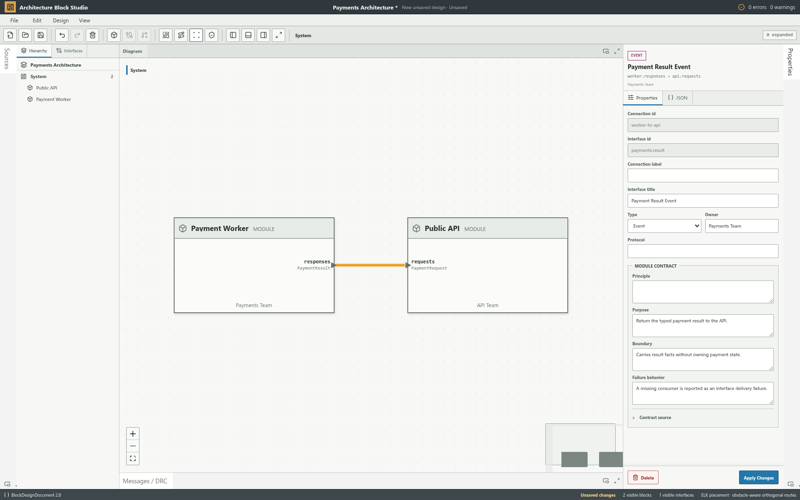
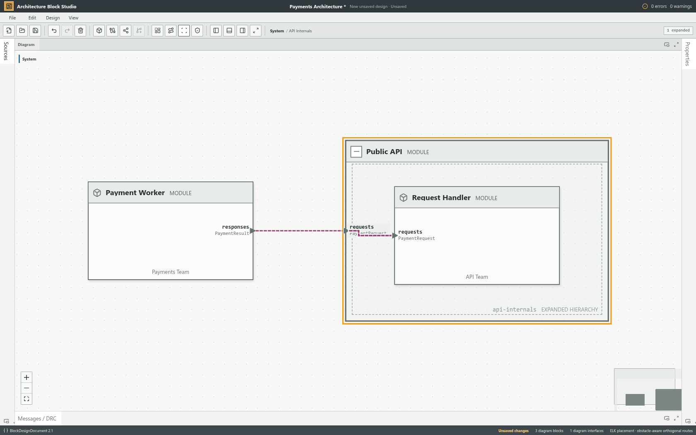
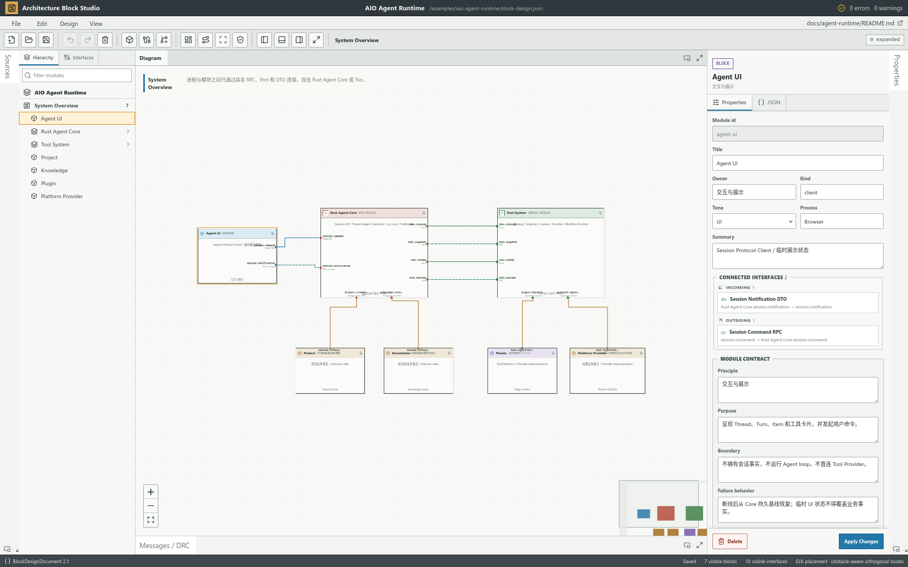
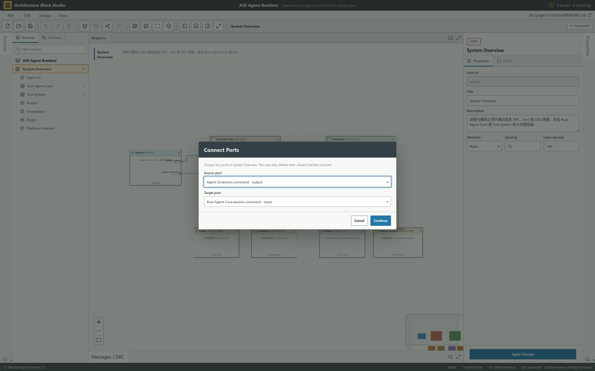
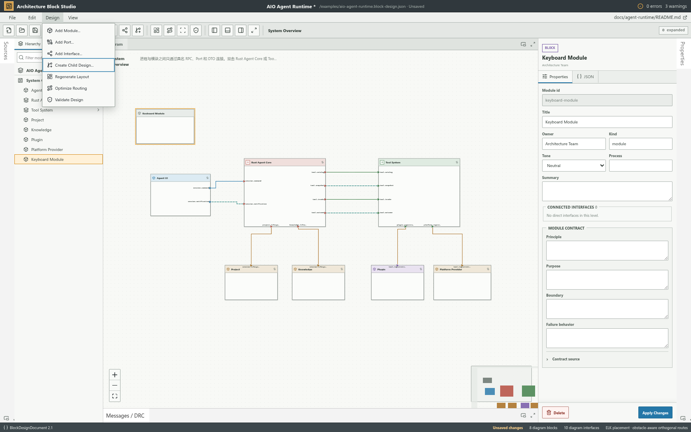

# Architecture Block Studio

> 面向 AI 编程时代的代码模块与接口设计工作台：设计系统、理解代码、审查架构。

Architecture Block Studio 把代码系统表达成可编辑、可校验、可版本化的模块设计。模块说明谁拥有职责，端口说明公开能力，连线说明类型化接口，层级说明内部结构；所有设计事实最终落在一份 `BlockDesignDocument` JSON 中。

它不只是“生成代码前画一张图”。它同时服务于三件事：

- **设计**：在实现前明确 Owner、职责边界、接口方向与失败行为，为人和 AI 提供稳定约束。
- **理解**：把已有代码或外部分析结果映射成模块、端口和依赖关系，从整体上读懂系统。
- **审查**：在代码变更后检查职责漂移、隐式依赖、越界调用与接口合同变化，补足逐行 Code Review 的结构视角。



## 为什么是现在

AI 让代码生成越来越快，也让结构退化越来越容易：同一职责被重复实现、调用关系藏进细节、模块边界在多轮修改中漂移。代码产量不再稀缺之后，真正稀缺的是人能否持续回答：

- 这项事实和状态由谁拥有？
- 模块为什么存在，又明确不负责什么？
- 模块之间只能通过哪些接口组合？
- AI 生成或修改的代码，是否仍遵守既定边界和依赖方向？

Architecture Block Studio 将这些问题变成可阅读、可编辑、可校验的设计对象，让架构意图能够进入版本控制，也能成为 AI 编程上下文和人工审查依据。

## 核心能力

- 像专业 IDE 一样新建、打开、编辑、保存、另存和导出设计。
- 创建模块、具名端口、RPC / DTO / Event / Stream 等类型化接口。
- 既可以在画布拖线，也可以通过 **Add Interface** 用键盘选择端点并创建同一类接口合同。
- 为模块和接口记录 Principle、Purpose、Boundary、Failure 与 Owner。
- 原位展开子设计，显式绑定父子端口，同时保留系统上下文。
- 在 Hierarchy 中按模块标题、id、Owner 或 Level 搜索，并直接定位画布与 Inspector。
- 选中模块即可查看直接入站 / 出站接口与对端，点击摘要进入完整接口合同。
- 使用 DRC 检查结构、引用、方向、必连端口和合同完整性，并直接查看修正方向。
- 使用 ELK 生成分层布局，并用正交避障路由保持复杂设计可读。
- 缩放到系统总览时只保留模块标题、端口名和线路，放大后自动恢复 Owner、摘要、类型等完整细节。
- 选中连线后拖动正交线段，手动路由随 JSON 保存，也可随时恢复自动布线。
- 画布不显示线中标签；端口承担局部识别，点击连线后由 Inspector 展示完整合同。
- 通过 Undo / Redo、事务性加载和 dirty 状态保护编辑过程。



选中连线后，画布显示可拖动的正交线段把手，Inspector 同步显示手动路由状态和恢复自动布线入口。


在既有复杂设计中继续新增模块和接口时，线路仍从正确端口侧进出，并避开其他模块；自动路径可直接选中，再用鼠标或方向键调整，最终随同一份 JSON 保存。


面对陌生或大型设计，可以直接搜索模块、Owner 或所属 Level；结果仍使用同一选择语义，不会制造脱离画布的第二份结构。


模块的直接依赖从同一份设计文档实时派生，按入站与出站收敛在 Inspector 中；画布继续保持安静，不增加常驻标签。



不便使用鼠标或处理密集画布时，可以从统一命令入口选择源端口和目标端口，再进入同一个类型化接口合同流程。



菜单获得焦点后，可以直接输入 **F / E / D / V** 定位 File、Edit、Design 或 View；菜单展开后，输入命令首字母会跳到下一个可用项，重复输入可在同首字母命令间循环。例如在 Design 中用 **A** 依次访问 Add Module、Add Port、Add Interface，用 **C** 直达 Create Child Design。禁用命令会被跳过，不会形成无效操作。



## 5 分钟开始使用

需要 Node.js 22+ 与 pnpm 10.7+。

```bash
git clone https://github.com/xueyu888/architecture-block-studio.git
cd architecture-block-studio
pnpm install
pnpm dev --host 127.0.0.1 --port 4317
```

打开 [http://127.0.0.1:4317](http://127.0.0.1:4317)。应用会先展示仓库内置的 AIO Agent Runtime 示例；它只是演示数据，不是运行时依赖。

最短设计路径：

1. 选择 **File → New Design** 创建空白设计。
2. 添加模块，并填写 Owner、Purpose、Boundary 与 Failure。
3. 为模块添加 input、output 或 bidirectional 端口。
4. 从输出端口拖向输入端口，或选择 **Design → Add Interface** 用键盘选择端点，然后补全类型化接口合同。
5. 点击连线，在右侧 Inspector 审查名称、方向、Owner 与失败行为。
6. 运行 DRC，使用 **Save As** 下载 `.block-design.json` 文件。

## 加载自己的设计

当前设计内容来自一份 `BlockDesignDocument v2` JSON，可通过四种方式安装：

- **本地文件**：在 **File → Open Design** 中选择任意合法 JSON。
- **远程 URL**：加载同源或允许 CORS 的 HTTP(S) JSON。
- **启动参数**：使用 `?design=<encoded-url>` 替换默认示例。
- **组件嵌入**：向 `BlockDesignStudio` 传入 `initialDocument` 或 `initialDesignUrl`。

内置示例位于 [`public/examples/aio-agent-runtime.block-design.json`](public/examples/aio-agent-runtime.block-design.json)，可以复制、修改或换成自己的文档。加载是事务性的：新文件只有在解析成功后才会替换当前设计；无效文件不会破坏正在编辑的内容。

当前版本不会自动扫描或逆向解析源码。要把真实代码可视化，可由人、脚本或 AI 将源码中的模块、公开端口和依赖事实同步成 `BlockDesignDocument`，再用 Studio 理解和审查结构。

## 文档

- [产品定义](docs/PRODUCT.md)：用户、核心旅程、产品边界与演进方向。
- [系统架构](docs/ARCHITECTURE.md)：Owner、状态分类、依赖方向、公开接口与 Schema 兼容策略。
- [质量标准](docs/QUALITY.md)：生产级 Definition of Done、测试矩阵、文件安全与发布门槛。
- [演进路线](docs/ROADMAP.md)：当前成熟度、问题优先级与真实迭代记录。
- [第三方许可](THIRD_PARTY_NOTICES.md)：依赖与许可证信息。

## 开发与验证

```bash
pnpm exec playwright install chromium firefox
pnpm typecheck
pnpm build
pnpm test
pnpm test:e2e:firefox
```

## 当前边界

- 当前是本地单人工作台，不包含账号、服务端存储、多人协作或冲突合并。
- Save / Save As 使用浏览器下载语义，不会越过浏览器权限覆盖任意系统文件。
- 当前写出 `BlockDesignDocument 2.1`，可显式读取并迁移 `2.0`；尚未提供 v1 或 Draw.io 导入器。
- 可视化审查补充模块与接口视角，不替代逐行 Code Review、测试、静态分析或安全审计。

## 许可证

MIT，详见 [`LICENSE`](LICENSE)。
