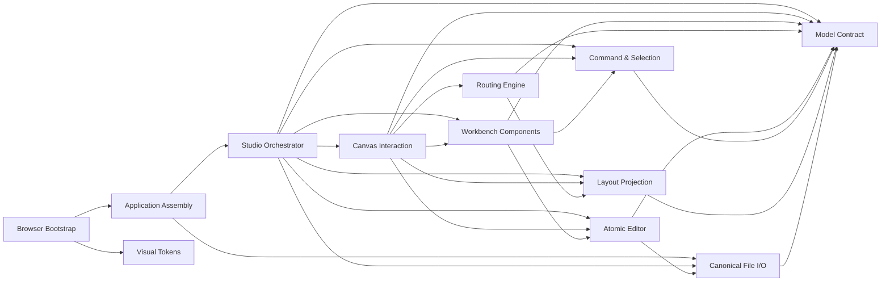

# 系统架构

## 架构原则

Architecture Block Studio 的核心不变量是：`BlockDesignDocument` 是唯一设计事实源。UI、布局、路由、DRC 和工作区状态都只能消费或通过具名操作更新它，不能建立第二份设计状态。

```text
Menu / Toolbar / Keyboard / Canvas / Inspector
                       │
                       │ DesignOperation
                       ▼
             editor：原子文档变换
                │ success      │ failure
                ▼              ▼
       BlockDesignDocument   可见错误，原文档不变
          │       │       │
          │       │       └──────────────► io：解析 / 序列化 / 下载
          │       └──────────────────────► model：Schema / DRC / 图查询
          ├────────► layout/types：纯 Flow 投影
          ├────────► routing：场景适配 / 正交多连接求解 / 独立验证
          └────────► studio/selection：工作区选择协议
                              │
                              ▼
                 components/canvasTypes ─► React Flow
                              │
                              └──────────► Tree / Inspector / Messages
```

依赖方向从稳定的文档契约指向派生能力，再由 Studio 组合成产品。布局、路由或组件不得反向拥有文档语义。

Windows 交付层只适配操作系统能力，不进入设计内核：

```text
React Studio ──具名 DesktopBridge──► sandbox preload ──具名 IPC──► Electron main
     │                                                                  │
     └── BlockDesignDocument ◄── canonical JSON ────────────────────────┘
                                                                        ├─ 原生 Open / Save 对话框
                                                                        └─ 受限 JSON 原子读写
```

`BlockDesignDocument` 仍是设计事实，Editor 仍唯一拥有 dirty / saved baseline。Electron main 只拥有窗口会话中的当前文件路径、原生对话框和磁盘 IO；路径不返回 renderer、不写入 JSON。preload 只暴露逐项命名的方法，不暴露 Node、任意 IPC、任意路径或通用文件系统。

## 模块与 Owner

| 模块 | 原则与所有权 | 公开接口 | 边界与失败行为 |
| --- | --- | --- | --- |
| `src/model` | 拥有文档结构、Schema 版本与迁移、语义设计规则和无状态图查询 | `BlockDesignDocument`、`BLOCK_DESIGN_SCHEMA_VERSION`、`blockDesignSchemaCompatibility`、`parseBlockDesignDocument`、`validateBlockDesignDocument`、`listModuleInterfaces`、`normalizeConnectionEndpoints` | 不负责 UI、历史或布局；版本与结构非法时在字段路径拒绝，语义问题输出 DRC，查询与连接规范化不持有状态 |
| `src/editor` | 拥有原子文档变换、历史、dirty 判断与可移植设计片段的引用完整性 | `DesignOperation`、`DesignFragment`、`createDesignFragment`、`parseDesignFragment`、`applyDesignOperation`、`useDesignEditor`、具名工厂 | 不渲染、不路由、不持久化；片段必须自包含，失败不产生部分修改 |
| `src/io` | 拥有外部 JSON 与已校验文档之间的转换，以及 renderer 可见的最小桌面文件协议 | `loadDesignFromObject/Text/File/Url`、`serializeDesign`、`downloadDesign`、`ArchitectureBlockStudioDesktopBridge` | 不解释模块业务、不持有系统路径；加载失败保留已安装文档 |
| `src/layout` | 从文档与展开状态派生纯复合节点、边和位置投影，定义布局真正消费的签名，并提供不持有交互状态的网格、辅助线、多选编排与组选区缩放几何 | `layoutBlockDesign`、`layoutFrameSignature`、`layoutProjectionSignature`、`DESIGN_GRID_SIZE`、`snapMovingRect`、`snapResizingRect`、`resizeSelectionGroup`、`alignSelection`、`distributeSelection`、`LayoutResult`、`PlacementMode` | 不依赖 Studio 或 React 交互回调，不修改源文档；没有合法辅助线时只应用显式网格策略，没有网格时原样返回预览几何，非法几何、编排输入或布局失败上抛给 Studio |
| `src/routing` | 从绝对布局几何和锁定 waypoint 构造 `RoutingScene`，统一拥有版本化正交多连接策略、规模资源预算、确定性求解、证明等级与独立验证；同一布局投影还向 pointer preview 提供只读障碍、规范端口和层级域，另提供手工路线编辑几何与线桥 | `createRoutingLayoutProjectionFromLayout`、`createRoutingSceneFromLayout`、`solveConnectionPreview`、`routingPolicyForScene`、`solveRoutingScene`、`verifyRoutingResult`、`planRouteJumps`、`RoutingScene`、`RoutingPolicy`、`RoutingResult` | 设计坐标是路由事实；不移动模块、不改文档、不持有 gesture；preview 只解一条可丢弃 leg，不参与多线 lane 协调；规模只收紧同一策略的有界资源，不改变几何与失败语义。失败返回明确无解，不调用第二套自动 fallback。完整合同见 [`ROUTING.md`](ROUTING.md) |
| `src/components` | 将纯布局投影组合为可交互 Canvas，拥有选中几何的 viewport framing、具名缩放请求投影与直接手势的持续边缘平移，并展示用户视图、发出用户意图 | `CanvasBlockNodeData`、`CanvasInterfaceEdgeData`、`CanvasViewportActionRequest`、`ViewportAutoPanController`、`canvasGeometryBounds`、Canvas、Node、Edge、Tree、Inspector、Dialogs、Dock、Messages | 交互回调只存在于 Canvas 投影；viewport 只消费节点矩形、线路点集、指针压力和可丢弃动作请求，不直接深改文档，自动平移不得提交设计操作，局部表单草稿不得伪装成已提交事实 |
| `src/studio` | 组合公开能力，拥有工作区选择协议、临时设计剪贴板与无碰撞粘贴位置投影 | `BlockDesignStudio`、`BlockDesignStudioProps`、`SelectionRef`、`selectAllInLevel`、`findDesignFragmentPlacement` 及纯选择查询 | 不重新定义 Schema、片段引用、布局或编辑规则；系统剪贴板失败时同源退化，组合失败应可见、可恢复 |
| `src/App.tsx` | 提供独立应用的默认装配 | 默认示例 URL 与查询参数入口 | 示例不是核心依赖，不拥有设计内容 |
| `desktop` | 拥有 Windows 窗口、会话文件绑定、原生对话框、关闭保护与 JSON 原子读写 | Electron main、sandbox preload、具名 IPC、`readDesignFile`、`writeDesignFile` | 不解释或修改设计语义；renderer 不获得 Node / 路径 / 通用 IPC，失败不清除 dirty 或替换当前文件绑定 |
| `tests/performance` + `scripts/performance-baseline.mjs` | 拥有压力观测样本合同与重复聚合入口 | `performance-sample v1`、`performance-trend-report v1`、`pnpm performance:baseline` | 只验证产品合同，不被运行时代码依赖，不写回设计 JSON；环境或样本漂移时停止生成可信报告 |

`BlockDesignStudio.tsx` 当前承担较多编排职责，但它仍通过上述公开接口组合模块。后续只有在出现独立变化原因时才拆出命令协调器；不能建立囊括所有能力的全局 Service 或共享可变状态。

当前依赖核查中，`model` 不依赖任何上层模块，`layout` 与 `io` 只消费模型合同，`routing` 只消费几何库类型；`editor` 只额外复用 `io` 的纯 canonical snapshot 序列化，避免 dirty、历史和文件输出出现第二套规则。组件对 `studio` 的引用仅指向无 UI 依赖的 `commands` / `selection` 叶子协议，这两个协议不反向导入组件；`BlockDesignStudio` 才负责组合具体组件。文件行数本身不是拆分依据，只有独立状态、规则或变化原因出现时才建立新 Owner。

## 源码架构示例与一致性门禁

`scripts/generate-self-architecture.mjs` 是“源码事实如何投影成示例设计”的单一适配器。`src` 中真实存在的 TypeScript / TSX / CSS 文件与可解析相对 import 是源事实；脚本中的 `MODULES` 只拥有稳定责任边界、源码归属、说明和展示位置；生成的 `public/examples/architecture-block-studio.block-design.json` 是可重建投影，不得反向定义源码依赖。浏览器运行时仍只消费公开 JSON，不读取仓库文件系统。



图中箭头严格表达“左侧源码模块 import 右侧模块”，不是运行时数据流，也不按卡片相对位置猜方向。`Studio Orchestrator` 与叶子 `Command & Selection` 分开，是因为前者拥有产品组合，后者只拥有无 UI 依赖的命令和选择协议；Canvas 与 Workbench 也按直接画布手势和外围审查界面分开。这个划分恰好覆盖当前 68 个受管源码文件，不能漏文件或让一个文件同时属于多个模块。桌面主进程是 OS 适配边界，不反向进入这张 renderer 源码依赖图。

生成和验证必须保持以下不变量：

- 每个受管源码文件恰好映射到一个责任模块。
- 每条生成连接都由至少一条已解析相对 import 支撑；每条跨模块 import 也必须进入生成图。
- 依赖图必须无环；否则脚本报告完整环路径并失败。
- 示例固定表达 product → browser runtime → workbench composition → verified source architecture → runtime modules 五层上下文；层级只是审查范围，不隐藏第 5 层真实依赖。
- `pnpm verify:self-architecture` 按字节比较当前投影与已提交示例；production build 先执行该门禁，漂移时不得继续构建陈旧架构图。

失败只阻止生成或构建，不自动移动源码、不改 import，也不猜测新的业务边界。若源码出现无法唯一归属的新职责，必须先明确 Owner，再更新适配器；不能用通配 fallback 把它塞进大一统模块。

## 工作台与视觉系统

工作台采用稳定的专业画布骨架：文档标题和校验摘要位于顶层，菜单负责完整命令发现，分组工具栏承载高频动作；Sources、Canvas、Inspector 构成主要横向工作区，Messages / DRC 与状态栏提供按需反馈。Canvas 始终是视觉主面，左右面板是上下文，只有选择、错误、dirty 和主操作使用强调色。改变面板显隐、Dock 布局或视觉样式不会改变设计事实。

`src/styles.css` 的 `:root` 是颜色、边界、控件高度、圆角、阴影、层级和动效时长的唯一视觉常量 Owner。组件只通过自身语义 class 表达“这是菜单、节点、属性面板或状态”，不得复制同一 surface、border、selection、z-index 或 control 尺寸；React Flow 的网格与 MiniMap 遮罩同样消费该 token 层。`StudioToolbar` 只依据 `StudioCommands` 投影命令，并用具名 `role="group"` 表达视觉分组，不拥有命令状态。它拥有常驻展示集合：File、History、Create 以及 Fit / Validate 表达启动、连续编辑、建模和审查直接工作流；低频全图布局与已有 Dock 上下文入口的面板动作仍由完整 Menu / Command Palette 投影。展示集合不进入命令合同，不能反向改变 execute 或 eligibility。视觉 token 只被组件消费，不依赖组件，也不进入 JSON、历史、selection 或布局结果。

`Tooltip` 只拥有 pointer 延迟、focus 即时打开、Esc / pointer down 关闭和 reduced-motion 展示，是命令提示的瞬时 UI Owner。它的公开输入只有 `label`、可选 `shortcut` / `detail` 与 placement；Toolbar 直接传入 `StudioCommands` 已拥有的名称、快捷键和 `unavailableReason`，Canvas viewport controls 传入自身公开动作名。Tooltip 不计算 eligibility、不执行命令、不让禁用按钮获得新的激活路径，也不持久化打开状态。Toolbar 与 Canvas controls 不再保留并行的原生 `title`，Menu 已有可见禁用原因也不再重复 title；事件取消或组件卸载时，待显示计时器被清理，原操作保持不变。

`CommandPalette` 是统一命令检索的瞬时 UI Owner，只拥有打开、查询和当前结果索引。它从 `StudioCommands` 实时派生命令列表，以名称、工具栏名称、快捷键和禁用原因匹配，不保存副本、不计算 eligibility；`showInPalette: false` 仅防止“打开命令面板”递归列出自身。可用项先通过共享 Dialog 焦点协议把焦点安全交还调用位置，再执行同一个 `execute`，后续 Editor Dialog 或 Messages 可以接管焦点；禁用项保持可读取但 Enter 与 pointer 都不执行。Esc、点击遮罩或无结果不会产生业务副作用，查询和焦点索引不进入历史、selection 或 JSON。

连接方向与连接点是两个正交的视觉角色。Canvas 只对非 hierarchy continuation 的真实连接投影一个 target marker，marker 的方向完全来自 `BlockConnection.source -> target` 路径末段；Port Handle 只表达“这里可以连接”，使用中性圆点，不用输入 / 输出三角形冒充数据流箭头。接口类型颜色由 edge 上的 `--interface-color` 统一提供给普通路径、React Flow 选中态和 `context-stroke` marker；第三方默认 selected stroke 不能成为第二颜色源。marker、Handle hover 和选中描边都属于可重建展示，不进入 JSON 或历史。

端口连接点几何与标签排版同样正交。`layout/nodeGeometry` 是节点安全尺寸、标签估算宽度和水平 label rail 位置的唯一计算 Owner；`BlockNode` 从同一组已排序 Port 分别投影稳定 Handle 和独立标签按钮，不能为了排文字移动 source / target。left / right 标签沿各自侧边，top / bottom 标签在 Header / Owner 之外的内部轨道分配空间；常态只显示端口名，dataType 只在可读缩放下通过 hover / focus 渐进显示，完整事实仍可由 Properties 查看。已有 authored width / height 满足标签合同时必须原样保留；只有外部 JSON 或后续 resize 小于内容安全下限时，布局投影才钳制到可读尺寸，不能把展示修正反写 JSON。

模块尺寸编辑复用同一几何 Owner。`minimumNodeDimensions` 从四侧端口和内容区计算可读下限，Canvas 只把这个纯结果投影为四边 / 四角 resize 限制；最大值来自节点几何合同，pointer 网格、键盘移动 / resize 步长和背景点阵共同消费 `DESIGN_GRID_SIZE`。Shift pointer resize 由纯 `preserveNodeAspectRatio` 以 gesture 起始矩形、抓手方向和同一尺寸上下限求解，固定对侧角或对侧边中心；比例不进入文档，并优先于兄弟尺寸吸附。多选时，`selectionResizeBounds / selectionResizeLimits / resizeSelectionGroup` 只接受同父级、同 Level、具有唯一可编辑投影的模块，以一个冻结的组包围框计算全组可行 scale，再用同一仿射变换更新每个成员的位置和尺寸。已有外部 JSON 若暂时超出当前上下限仍可被选中，但只允许朝合法范围变化，不能因显示组选区而抛错。Canvas 只拥有可丢弃预览，松手后发出一次位置加尺寸意图；Editor 的 `node/resize` 或 `nodes/resize` 才原子写入 `node.layout.position / width / height / pinned`。左边或上边缩放会同时改变锚点和尺寸，因此不能只写 width / height，否则视觉边界与持久几何会漂移。展开的 hierarchy 容器尺寸由子图边界派生，跨父级选择没有共同坐标系，两者都不提供组选区 resize 把手。

内联 Level 的坐标原点同样属于 Layout 契约，但不是新的持久事实。`layoutBlockDesign` 从 authored bounds 发布 `coordinateOrigin = min(0, authoredMin)`：非负设计固定为 `(0,0)`，负坐标旧文件保留既有最小值；`designOrigin` 只把该坐标系投影到展开 owner 的 local flow space。`layout/levelGeometry` 是 move / resize 边界的纯 Owner：它把同一组选中模块收敛成一个共同 delta，把左 / 上 resize 收敛成一个 start-edge 区间，并在负原点 owner 全部参与手势时锁住该轴。Canvas 只负责从 Layout 节点构造约束、生成临时预览并把 flow delta 换回 authored delta；Alt、网格、参考线和 auto-pan 都不能修改边界。Editor 仍只接收最终 `node/move`、`nodes/move`、`node/resize` 或 `nodes/resize`，拒绝 / Escape / blur 恢复文档投影且零写入。

```text
BlockDesignDocument (authored position / size)
          │
          ▼
layoutBlockDesign ──► stable coordinateOrigin + disposable flow projection
          │                                      │
          ▼                                      ▼
 levelGeometry constraint ◄── raw pointer / Alt / keyboard / group handle
          │                                      │
          └────────► disposable Canvas preview ──┘
                                      │ one authored delta batch
                                      ▼
                              Atomic Editor operation
                                      │
                                      └──► BlockDesignDocument
```

路由不参与坐标决策，只消费重新派生的 absolute frames。等价场景整体平移时，可见图 arc、候选审美排序和验证证书必须使用相对 source 的 route signature；绝对坐标仍用于碰撞与绘制，但不得成为等成本线路的隐式选择依据。这样父容器因右 / 下内容增长而平移或扩展时，只改变最终 SVG 坐标，不会凭空选择另一条拓扑路线。

网格、对齐与等距辅助线沿用同一几何链，但都不拥有设计事实。Canvas 在 move / resize 开始时冻结父级坐标原点，并只收集同一父级、当前视口附近的模块矩形，把 6 CSS px 容差换算为设计坐标；多选移动与多选缩放都先从全部成员冻结一个组包围框，pointer 只改变这个统一 subject。`layout/alignmentGuides` 在每个移动轴上先从正交轴真实重叠、与主体保持正间距的候选中确定最近前后邻居；若原始 pointer 几何已经接近“主体位于两邻居之间等距”或“主体延续相邻两模块间距”，就以同一个 `snapMovingRect` 返回唯一 correction 和恰好两段无文字间距括号。该轴未命中等距时才选择最近边缘 / 中心，仍未命中才按父级相对 `DESIGN_GRID_SIZE` 取整；单选与组选区 resize 共用 `snapResizingRect` 的位置、同宽 / 同高和网格优先级。等距优先于冲突对齐，候选按距离、关系类型和稳定 id 排序，不能因遍历顺序产生跳动。React Flow 的全局 `snapToGrid` 已关闭，不能在纯策略之前偷偷生成第二份几何。`AlignmentGuideLayer` 只渲染当前 gesture 的临时直线、尺寸或等距括号；间距值只用于几何断言，不渲染成会遮挡线路的标签。松手后仍只提交既有 `node/move`、`nodes/move`、`fragment/insert`、`node/resize` 或 `nodes/resize`；先以 pointerdown 建立直接 move / resize，再按住 Alt 时，同时跳过等距、对齐和网格，原样使用用户预览。Alt 在 pointerdown 前成立则属于选择协议并强制起框。跨父级混选、无正交重叠、只有单侧一个候选、吸附超出尺寸上下限或 Editor 拒绝提交时，不猜坐标、不建立补偿状态，Canvas 回到文档投影。

```text
pointer raw geometry ─► one axis snap policy ─► disposable Canvas preview ─► one DesignOperation
                               │                           │                         │
                 distance → alignment → grid      guides / transform       BlockDesignDocument
                    (Alt bypasses all)                 (not facts)          (only geometry fact)
```

多选对齐与分布复用 authored 几何，但与临时辅助线是独立能力。`layout/selectionArrangement` 只接收已解析的模块矩形：六种对齐以整个选择包围框为基准，水平 / 垂直分布按中心点等距并固定两端；项目没有隐式“主选择”，因此不会让点击顺序成为第二几何规则。`StudioCommands` 负责确认至少 2 个对齐对象或 3 个分布对象、全部是同一 Level 中具有唯一可编辑投影的 authored 模块，并为接口混选、跨层选择、展开 hierarchy 或未完成布局给出同源禁用原因。Arrange 菜单与 Command Palette 只投影这些命令；执行结果统一生成一次 `nodes/move`，Editor 原子写入各模块的 `node.layout.position / pinned`，随后布局与路由从文档重新派生。任一前提或提交失败时，原文档、历史和视口都不变。

复制链与选择链正交。`editor/designFragment` 是片段格式、引用闭包和 ID 重写的唯一 Owner：根层只收集所选模块之间的内部连接，递归包含这些模块拥有的全部子 Level，并只携带实际引用的接口定义；解析时逐级验证模块、Port、Connection、Hierarchy binding、父子 Level 和接口引用，拒绝缺失或多余事实。Studio 只从唯一可见的同层选择读取当前设计位置。Paste / Duplicate 用 `studio/fragmentPlacement` 对片段外包围框和当前可见模块矩形做 32 设计像素网格的最近无碰撞搜索；Ctrl/⌘ 拖动则把同组模块预览相对 authored geometry 的统一平移直接作为 offset。两种入口都只把明确 offset 随一次 `fragment/insert` 交给 Editor；Editor 在克隆文档上递增生成 Level、Module、Connection 与 Interface ID，重写全部引用后才通过完整 Schema 提交，所以一次插入只产生一个历史记录。

内部 `designClipboard`、系统剪贴板权限与连续粘贴序号都是可丢弃工作区状态。Copy 先安装内部片段，再尝试写入带 kind / version 的 JSON；写入失败只改变可见反馈，不撤销已成功的内部复制。Cut 先完成同一片段构造与序列化预检，再只把片段根模块交给一个 `objects/delete`；连接与独占后代 Level 继续由 Editor 级联，删除失败不改变源文档，成功后才异步镜像系统剪贴板。粘贴优先使用内部片段，没有时才读取并严格解析系统剪贴板。外部连接不会被隐式扩张进片段，因此粘贴后仍为 required 的边界 Port 可能由 DRC 提示未连接；这是待人审查的真实合同缺口，不能通过偷偷改成 optional 来消除警告。

```text
SelectionRef + LayoutResult
          │ 同一 Level、唯一可见模块位置
          ▼
createDesignFragment ─► versioned DesignFragment ─► internal/system clipboard
          │                                        │
          │                          parse + full reference closure
          └────────────────────────────────────────┘
                              │
                              ▼
findDesignFragmentPlacement（可丢弃视觉几何）
                              │ explicit offset
                              ▼
fragment/insert ─► Editor clone / ID rewrite / Schema ─► BlockDesignDocument
                                                         │
                                                         └─► one Undo snapshot
```

```text
SelectionRef.multiple + LayoutResult
                │ 解析同一 Level / 唯一可编辑投影
                ▼
StudioCommands（enabled / unavailableReason）
        │ execute                 └── failure ─► Menu / Palette 原因；不写入
        ▼
alignSelection / distributeSelection（纯目标位置）
        ▼
nodes/move ─► editor ─► BlockDesignDocument.node.layout
                                  │
                                  └──► layout + routing ─► Canvas
```

```text
BlockDesignDocument ─► model / editor / layout / routing ─► Studio ─► UI components
StudioCommands ───────────────────────────► Menu / Keyboard / Command Palette（完整）
              └───────────────────────────► Toolbar（12 个直接工作流投影）
Canvas viewport actions ──────────────────────────────────► Canvas controls
Menu / Toolbar / Canvas controls ── label / detail ───────► Tooltip
:root visual tokens ──────────────────────────────────────► all UI components
Dock / selection / dialogs / command query ─► disposable workspace state; never design JSON
```

视觉失败与业务失败保持正交：非法编辑继续由既有命令和 Editor 给出可见错误并保留原文档；视觉回归由 WCAG computed-color、1680 × 1050 / 1280 × 720 几何合同、双浏览器旅程和 headed 截图捕获，不能通过新增文档字段或组件局部特例补偿。

## 状态分类

系统必须区分五类状态，避免事实源漂移。

| 类型 | 当前 Owner | 例子 | 是否进入 JSON |
| --- | --- | --- | --- |
| 持久设计事实 | `BlockDesignDocument` | 文档、Level、模块、端口、接口、连接、层级绑定、authored 位置 / 尺寸与手动路由 | 是 |
| 派生设计结果 | `model` / `layout` / `routing` | DRC issues、模块关联接口摘要、Flow nodes、可视边、ELK 位置、正交路径 | 否，可重建 |
| 工作区状态 | `BlockDesignStudio` / Canvas / Dockview | 当前选择、展开 Level、面板布局、缩放、Fit 请求、自动布局模式、当前 gesture 的对齐辅助线、连接预览 session 与计数、内部设计剪贴板与连续粘贴序号 | 否 |
| 未提交编辑草稿 | 各 Inspector / Dialog 表单 | 输入框内容、待创建连接 | 否；提交后才生成 `DesignOperation` |
| 验证证据 | tests / screenshots / CI | 构建结果、几何检查、浏览器截图 | 否；只验证合同 |

关键规则：派生结果和验证证据不能反向定义文档；工作区状态不能写成架构事实；草稿必须显式提交或显式放弃，不能静默消失。

Dialog 草稿由各 Dialog 自己拥有，并在打开边界的 layout effect 中于浏览器产生可交互画面前完成初始化；同一次打开后的名称、ID、Owner、端点和合同输入只由用户交互继续更新。焦点协议随后只负责把焦点放入已经初始化的表单，不能用更晚的 passive effect 覆盖快速输入。提交仍只生成既有具名创建参数和 `DesignOperation`，取消则直接丢弃这份瞬时草稿。

`DesignIssue` 是 validation rule 的派生输出，包含稳定 id、severity、code、message、remediation 和可交叉定位的目标引用。语义规则在 `model/validation` 同时定义“发生了什么”和“下一步如何修正”，Messages 只负责筛选与展示；布局运行失败由 Studio 在同一诊断合同中补充恢复方向。remediation 不进入文档，也不能自动修改设计事实。

## 性能证据链

性能 fixture 仍从公开文档结构生成 1000 / 2000 压力输入；纯历史测试与浏览器旅程各自只测量自己拥有的行为，再共同输出同一版本样本。命令脚本只负责串行编排、严格校验和统计聚合：

```text
performanceDesign fixture
       │
       ├── history test ──────┐
       │                      │ performance-sample v1
       └── browser journey ───┤ scenario / run / environment / metrics
                              ▼
                   temporary raw samples
                              │ schema / sample / environment drift -> fail
                              ▼
                 observation-only trend report
                   min / median / max / mean / spread
```

原始样本和报告都写入被 Git 忽略的 `performance-results/`，属于可重建证据。它不复用 Playwright 拥有并会在运行前清理的 `test-results/`，因此两条测试生命周期互不覆盖。`BlockDesignDocument`、编辑历史和产品运行时不依赖这些文件。报告明确保存 `thresholds: null`，避免开发机观测反向成为产品性能合同；未来只有固定 CI 执行环境和足够历史样本才有资格建立数值门禁。

历史压力中的 canonical snapshot 字节数是由文件投影直接计算的确定性事实；进程 heap、ArrayBuffer 和耗时只是环境观测。`vitest.performance.config.ts` 是 GC 执行前提的唯一 Owner：使用单 fork，并通过该 fork 的 `execArgv` 暴露 GC。测试在测量前后显式回收，若 worker 没有 GC 能力则失败；package script 和聚合器不重复声明 V8 参数。

## 文档契约

### 顶层结构

`BlockDesignDocument v2` 包含：

- `schemaVersion`：当前精确值为 `"2.1"`。
- `id`、`title`、`summary`：文档身份与说明。
- `entryLevelId`：入口 Level 的唯一引用。
- `sourceRef`：可选的外部来源标签与链接。
- `interfaceDefinitions`：按接口 id 索引的独立合同表。
- `levels`：Level 数组，每个 Level 拥有自己的模块和连接。

### Level 与模块

Level 拥有 `nodes`、`connections` 和布局偏好。模块拥有稳定 id、名称、类型、Owner、端口、合同、可选 authored position 与可选 hierarchy。

模块合同由 `principle`、`purpose`、`boundary`、`failure`、可选源码合同和自定义属性组成。合同是设计事实，不是仅用于展示的说明文字。

### 端口、接口与连接

端口属于模块，定义 label、side、direction、dataType、required 与 order。连接属于 Level，引用明确的源端点、目标端点和 `interfaceDefinitions` 中的一个接口；可选 `routing.waypoints` 记录用户确认的 Level 局部坐标。没有 `routing` 时，路径完全由路由层派生。

独立接口定义拥有 kind、title、owner、protocol 与合同字段。多个连接可以引用同一接口定义，因此接口语义不能复制到边的临时 data 中维护。

### 层级

层级模块通过 `hierarchy.childLevelId` 指向子 Level，并通过 `hierarchy.portBindings` 将父端口绑定到一个明确内部端点。跨层关系不得根据名称、端口顺序或 interface id 猜测。

`BlockDesignDocument` 仍是层级结构的唯一事实源；当前视图根只是 Studio 拥有的可丢弃工作区状态。`hierarchyLevelTrail` 从 entry Level、`parentLevelId` 和唯一父模块引用派生 breadcrumb 与返回选择，`layoutBlockDesign(rootLevelId)` 只从指定 Level 开始生成画布投影。Enter、Exit、Architecture Home、breadcrumb、Sources 交叉定位和 Canvas 空白选择都消费同一个视图根；展开集合继续只决定当前根内哪些子设计原位展开。二者正交：进入 Level 不写展开状态，展开 Level 不擅自切换视图根。

视图切换不得写 JSON、History、authored geometry、接口方向或浏览器导航历史。进入后选择子 Level；退出时若父 Level 只有一个模块拥有该子设计，则重新选择该父模块并在布局完成后恢复可见焦点，否则安全退回父 Level。未应用 Inspector 草稿仍由统一选择保护拦截，取消确认时视图根和选择都保持不变。目标不存在、脱离 entry 层级或形成 parent cycle 时停止导航而不猜测 fallback。

## 编辑与历史

所有持久修改必须表示为 `DesignOperation`。`applyDesignOperation` 先克隆当前文档，在克隆上执行单项转换，最后通过完整 Schema 重新解析；任何异常都会使原文档保持不变。

模块尺寸变化使用单用途 `node/resize`。操作同时携带设计坐标中的 position 与 size，在一次完整 Schema 校验后提交；这样四边和四角使用同一合同，Undo / Redo 也只记录一个几何状态。Canvas 的 pointer preview、resize control 可见性和一次性焦点恢复都是 UI 状态；草稿保护或 Schema 拒绝时，Canvas 重新投影原文档几何，不产生补偿操作，也不保留局部尺寸。

模块组尺寸变化使用单用途 `nodes/resize`。它携带去重后的 Level、node、目标 position 与 size 列表；Editor 先验证整个批次的对象存在性和有限正尺寸，再在同一克隆中提交全部结果，因此多张卡片、端口和路线只跨越一个历史边界。Canvas 的八个组 handle、父级绝对 offset、当前 pointer、Shift / Alt 和自动平移 lease 都是可丢弃手势状态；提交失败或取消时一次恢复完整文档投影。

模块组移动使用单用途 `nodes/move`。它携带去重后的 Level、node 与目标 position 列表，Editor 在同一克隆上逐项验证存在性，全部成立后才一次提交并生成一个历史记录；单模块继续使用 `node/move`。这样 React Flow 的成组拖动不会出现“画面移动多个、JSON 只保存一个”的双状态，任一目标失效时也不会产生部分位移。

多选删除使用同样的原子边界，但删除闭包由 Editor 而不是 UI 拥有。`SelectionRef.multiple` 只允许 canonical module / connection 引用；Studio 将其映射成一个 `objects/delete`，不在 Canvas 里猜级联。Editor 先在原始克隆上验证目标非空、无重复且全部存在，再删除显式 connection，最后依据 `DesignLevel.parentLevelId` 由深到浅删除 node。单节点现有合同继续负责相连接口、跨层 Port binding、全局未使用接口定义和仅由该节点拥有的后代 Level；共享 child Level 仍由外部 owner 引用而保留。父级级联已覆盖的显式后代只视为同一删除闭包，不成为第二次失败。任一预检失败都不改变源文档或历史；成功只生成一个 history snapshot，一次 Undo 恢复整个混选。确认框、删除后回到 entry Level 的选择和提示都是工作区状态，不进入 JSON。

子图插入使用单用途 `fragment/insert`。操作携带已经通过片段合同的 `DesignFragment`、目标 Level 和由视觉放置 Owner 计算的明确 offset；Editor 不读取 Canvas，也不自行猜测屏幕空位。ID 递增与引用重写在同一克隆中完成，任何缺失端点、Port、接口定义、层级父子关系或非法 offset 都拒绝整项操作。Paste、Duplicate 与 Ctrl/⌘ 拖动都复用“从当前选择构造片段，再执行一次 insert”的同一链路，不维护第二套克隆规则。Cut 与插入正交：它复用同一片段构造，但源图变化只走既有 `objects/delete`，不会把“移动”伪造成一个同时拥有两个文档的跨工作区 Editor 操作。

线路端点变化使用独立的 `connection/reconnect`：Editor 在同一 Level 内重新校验 source / target 端口存在性与 input / output 方向，保留连接 id、interface id 和接口合同。手动 waypoint 描述的是旧端点几何，因此重连成功时由该操作清除 `routing`，重新进入自动路由；非法目标拒绝整项操作，原端点和原路线都不变。Canvas 只负责把拖拽结果规范化成端点意图，不复制方向规则。

具名对象创建时，`editor` 的 `suggestId` 与 `uniqueId` 是合法化和当前作用域唯一性规则的唯一来源；Studio 提供已有 id，Dialog 只维护“名称仍联动建议 id / 用户已手工定制 id”的临时草稿状态。名称变化只在用户尚未定制 id 时更新建议，提交后仍通过原有创建工厂和 `DesignOperation` 进入文档，联动状态本身不进入 JSON 或历史。

`useDesignEditor` 的当前文档始终是结构化对象；Undo / Redo 历史则保存 canonical compact JSON 的 UTF-8 `Uint8Array` 快照，恢复时重新经过 `parseBlockDesignDocument`。它没有建立第二种文件语义：人类可读下载与 compact history 都复用 `src/io` 的同一个 canonical 投影，区别只有空白格式。saved baseline 仍使用 canonical 字符串，dirty 比较在文档或 saved baseline 真正变化时才计算，普通 Studio 重渲染不重复序列化。

压力基线证明该表示在 1000 modules / 2000 connections 下，单份 compact snapshot 为 1,639,002 bytes，20 次操作连同当前文档共保留 34,419,093 bytes；历史仍没有容量上限。步数上限、按字节淘汰还是持久恢复属于产品语义，在明确前不由实现层擅自选择。

删除操作负责维护引用完整性：删除模块、端口、连接或子层级时，同一编辑 Owner 内完成必要级联并清理不再使用的接口定义。UI 不应自行拼接级联规则。

## 加载、保存与失败语义

- `loadDesignFromObject` 是所有加载路径的共同结构校验入口。
- 桌面文本、本地文件、URL 和嵌入对象最终都经过同一个 `loadDesignFromObject`；UTF-8 BOM 只在文本边界剥离。
- URL、本地文件和嵌入对象只有解析成功后才会调用安装逻辑。
- 解析失败返回 `DesignLoadError` 与字段路径，当前设计保持不变。
- `serializeDesign` 使用两空格缩进和结尾换行；`interfaceDefinitions` 与模块 / 接口 `attributes` 按稳定 key 顺序写出，Level、模块、Port、连接与 waypoint 数组保留设计顺序。
- canonicalization 只生成临时 IO 投影，不修改 `BlockDesignDocument`；Save、Save As、Export 和 dirty baseline 共用这一个序列化合同。
- Windows Open 先读取并返回一次性 token，renderer 完成 Schema 校验后才确认当前文件绑定；非法 JSON 不能偷换当前文件。
- Windows Save / Save As 使用相邻临时文件、flush 和 rename 完成原子替换；只有写入成功后 Editor 才把精确当前快照标记为 saved。
- Export JSON 只导出副本，不改变当前文件绑定或 dirty 状态。
- 新建、从开发 URL 或浏览器文件载入会显式清除桌面文件绑定；文件路径只留在对应窗口的主进程状态中。

开发浏览器保留下载适配器，用于自动化验证，不是产品文件语义。当前仍没有崩溃后的自动恢复；恢复副本必须作为独立文件安全设计引入，不能把 localStorage 或临时 UI 状态当作正式设计事实源。

## 布局与布线不变量

- 布局输入只有文档、展开 Level、placement mode 和 revision；输出是可重建的 `LayoutResult`。
- `layoutProjectionSignature` 由布局 Owner 枚举布局与 Canvas 真正消费的模块可见字段、端口、拓扑、接口类型和手工路由；文档 / Level 说明和 Inspector 合同正文不在该投影中。只有投影变化才重建 React Flow 图。
- `layoutFrameSignature` 只包含会改变拓扑、端点、Port 或层级边界的框架事实，用于决定是否重新 Fit；直接 move / resize 已由用户指定当前视野，不能再次 Fit 并把选中模块移出 viewport，可见标题变化同样不能冒充框架变化。
- Level 标题覆盖层与重型 React Flow 图分开渲染；工作区命令回调通过稳定边界读取最新事实，普通属性编辑不能因 callback identity 变化重映射全部节点和边。
- Canvas selection 只在受影响的前后节点 / 边对象上投影 `selected`，未受影响的 Flow 元素保持引用稳定；React Flow 事件、配置对象和静态控件同样保持稳定，选择不能借回调或 JSX identity 触发全图协调。
- Canvas detail level 只从 React Flow viewport 的 zoom 派生，并以根节点展示属性投影给 CSS；低缩放隐藏不可读的 process、摘要、Owner 和 data type，但始终保留模块标题、端口名、端口把手与线路。节点不分别订阅 viewport，这个展示策略不进入文档、历史或布局结果。
- MiniMap 是可丢弃的 viewport 导航，不是设计事实。宽屏工作台常驻显示；紧凑桌面默认收起并在 Canvas controls 提供显式 Show / Hide overview map，避免覆盖模块或线路。开关状态不进入 JSON、历史、selection 或 Dock 布局。
- 布线资源边界与 Canvas 视口裁剪是两个独立策略：大型场景只减少同一 `orthogonal-scene-v1` 策略的候选顶点、相关障碍物和迭代数，后者只减少压力图的 DOM 挂载。两者都不得删减 `LayoutResult`、React Flow store、MiniMap、图中总数或保存输出；200 / 400 档继续全量挂载以执行每条路径的几何门禁。
- 视口导航同样与设计事实正交：默认和 200 / 400 图使用 280 ms 平滑定位；启用视口裁剪的压力图使用单次直接定位，避免插值途中持续换挂载。React Flow MiniMap 会保留首次 `onNodeClick` 闭包，因此 Canvas 暴露稳定回调并从 ref 读取最新规模策略；不能让第三方回调生命周期冻结空布局时期的配置。
- 用户拖动期间的 position 只是 React Flow 预览；松手时 Canvas 按选中模块数量请求一次 `node/move` 或 `nodes/move`。成组移动保留各模块相对位置并共同接受参考线修正；多选对齐 / 分布同样只生成一次 `nodes/move`，不能按节点拆成多次提交。只有 Editor 接受后，各自的 `node.layout.position` 才成为新位置。若草稿保护、对象存在性或可编辑性规则拒绝操作，Canvas 一次恢复全部 base node 文档投影，不创建补偿操作、不覆盖错误提示或未应用草稿。ELK 自动位置不写回文档。
- 用户拖动单模块或多模块选择框的四边 / 四角期间，position 与 dimensions 只是 React Flow 预览；松手分别只提交一次 `node/resize` 或 `nodes/resize`。被接受后，布局、端口和线路都从新的文档几何重算；被拒绝后，整组选区恢复原投影。组 handle 通过逆 viewport scale 保持 18 CSS px 命中区，低缩放不会变成不可操作的微点。选中单模块上的 Ctrl/Cmd + Shift + Arrow 按 16 设计像素调整宽或高；Shift + Arrow 单独按下由 Canvas 拦截且不得产生第三方临时位移或尺寸副本。成功提交后通过一次性 `NodeFocusRequest` 恢复焦点，公告只从被接受的新尺寸派生。
- 展开子设计时，子节点使用 compound parent 与相对位置，父模块继续提供上下文和边界。
- 路径从具名源端口开始，在具名目标端口结束。
- 每条可见逻辑连接只在真实 target 显示一个语义箭头；内部 hierarchy continuation 不重复显示箭头，Port Handle 不承担方向表达。
- 路径不得穿过无关模块或无关层级容器。
- 跨层路径只通过 hierarchy binding 生成 continuation。
- `RoutingSceneAdapter` 把绝对节点矩形、量化端口、层级布线域、commodity / Gate 和锁定 waypoint 映射为纯 `RoutingScene`；同一次 `RoutingLayoutProjection` 还提供只读 preview environment，按 `nodeId + handleId` 暴露与正式路线完全相同的规范端口锚点。adapter 不求路，Canvas 不再为单条 Edge 收集障碍物或按模块对生成 channel。
- `solveRoutingScene` 先在外扩安全域上建立单连接基准，再以 `U → Q → X → Dmax → Dsum → bends → short segments → signature` 的字典序目标协调当前全部可见 leg。只有真实共线或小于 lane 间距的投影才形成容量冲突；connection id 不生成 lane 偏移。
- 单连接在版本化完整局部候选可见图中求最优；多连接执行有界 negotiated solve 并由独立 verifier 复算合法性和目标。证书必须列出逐 leg 审计 id 和全部已布通无序线对数量；`Optimal`、`Feasible`、`Unresolved`、`InvalidInput` 与保留的 `Infeasible` 具有不同证明含义，不能把找到路线等同于全局最优。
- 相邻同轴反向、路径自交、端口法向错误、穿过安全域、Gate 不连续、超出显式绕行上限和小于 lane 间距都不能作为合法结果。唯一允许的共线是同一物理端口的固定短 stub。
- Port anchor 的边框、展开态边框和 Handle 尺寸由 `layout/nodeGeometry.portAnchorOffset` 与同一组 CSS 变量共同拥有；可见圆点与 React Flow 内外 Handle 使用同一物理坐标。障碍物和 authored 几何按 1 / `coordinateScale` 量化，端点再归一到视觉整像素；小于 1 设计像素的浏览器测量误差继续投影该 anchor，真正的 move / resize 预览才让首尾相邻 leg 随当前端点平移，不能生成亚像素补偿折点。Fit、缩放和设备像素比不能反向改写路径事实。完整数学定义、策略默认值和证书见 [`ROUTING.md`](ROUTING.md)。
- `planRouteJumps` 只从已验证 `PlannedRoute.points` 派生交叉处的 SVG 线桥：水平线跨过垂直线，相邻交点可合并，端点附近不画桥。它不改变路线、交叉目标、marker、命中几何或 JSON；浏览器逐线对审计必须确认每个严格交叉都有桥且不存在孤立桥。
- 线路编辑器区分三种职责：空心菱形是从自动 / 手动路径派生的虚拟线段抓手，拖动会移动整段并物化手动 route；实心方点只投影已确认手动路线的真实折点，可拖动、Arrow 微调、Delete 或双击删除；小实心端点只提示可重连，真正的透明命中圆由 React Flow 管理。它们都不是新的设计事实。
- 用户拖动线段或折点时，预览是临时 UI 状态；只有坐标真正改变，松手才提交一次 `connection/route`。拖动端点只提交一次 `connection/reconnect`。单击抓手、取消拖动或非法目标不得把自动路径误写成手动事实。
- 键盘重连与 pointer 重连共享同一事实链。`model/graph` 拥有 source / target 候选、当前连接端点解析和“是否存在替代配对”的纯规则；`StudioCommands` 只表达当前选择下的可用性，Design 菜单、Command Palette 与 Inspector 只投影该命令；Dialog 只保存未提交的端点 key。端点未变化时提交按钮禁用，不调用 Editor；变化后仍只调用既有 `connection/reconnect`，由 Editor 原子校验并清除旧 waypoint。Dialog 关闭后的 Inspector 焦点请求是一次性工作区状态，不进入 JSON、历史或路由。
- Pointer 创建 / 重连由 Canvas 内一个显式、短生命周期的 connection gesture 拥有：只记录模式、起点、当前 hover target 和提交结果。端口 DOM 上的 `origin / candidate / incompatible` role 与状态面板由该 gesture 和 `model/graph` 的唯一合法性规则派生；线路预览则把当前端点意图交给 `ConnectionPreviewSession`。session 创建时通过 `RoutingObstacleCatalog` 把静态障碍安全域只注册一次，变化后的 pointer 坐标立即进入 `solveConnectionPreview`；仅量化请求完全相同且不足 30ms 时复用最近确定性结果。吸附端点必须用 layout projection 中 `nodeId + handleId` 对应的规范锚点，React Flow 的可点击外框坐标不能成为第二端点事实；自由指针才使用当前 pointer 位置，并由可选 terminal 类型明确表示它没有模块障碍。preview 复用正式场景的 clearance、端口法向、祖先忽略、同父级 routing domain、量化和 verifier，但每次只提交一条可丢弃 leg，并关闭没有意义的多线协商。无验证路线时返回空点集并显示 blocked，禁止退回穿卡直线；吸附后成功预览与单线正式提交使用同一几何。预览不画正式 target marker，避免从 input 端起拖时伪造语义方向。Escape、window blur、空白或非法落点会同时销毁 session、清理第三方拖线状态、候选投影和待提交结果；即使稍后的 pointerup 仍到达，也必须被 cancelled guard 拒绝。只有实际变化的合法端点才进入 Studio → Editor；同端点在 Editor 与 History 两层都保持语义 no-op。目录、最近结果、求解耗时、障碍数、请求 / 求解 / 命中计数、反馈和候选样式均为展示 / 验证状态，不进入 JSON、选择或历史。
- React Flow viewport 的 zoom 还派生一个根级 inverse-zoom CSS 变量；线段与折点抓手保持 20–24 CSS px 命中区，内部菱形 / 方点更小；重连仍保留 20 设计像素透明命中圆，但视觉只显示 10 设计像素实心点，避免与真实 Port 形成第二个大圆环。该变量和命中几何只参与交互展示，不改变 waypoint、端点或路由计算。
- 键盘移动抓手时，每次 Arrow 只提交一个 8 设计像素的 `connection/route` 操作；因为受控 Edge 会在文档投影更新时重建，Canvas 用一次性 `RouteHandleFocusRequest` 按 edge、抓手类型、索引和新坐标等待完全匹配的几何后恢复焦点，不能提前命中旧 DOM。该请求只负责连续输入，不进入设计、历史或路由算法。
- 手动路由提交与端点位置恢复都复用同一个正交化函数；相邻 waypoints 必须共享 x 或 y，Schema 同样校验这一不变量，外部 JSON 不能产生斜线。
- 手动 waypoints 属于连接所在 Level；hierarchy continuation 仍是自动投影，不复制手动事实。
- 白色衬底保证线与网格、容器和相邻路径可区分。
- 接口类型颜色在普通态、选中态和 target marker 中保持一致；选择只能增强线宽、阴影和把手，不能抹掉接口类型。
- 线中不渲染标签；端口名提供局部识别，Inspector 提供完整接口语义。
- Optimize Routing 只请求重新派生路线；确定性输入不会因 revision 本身跳线。Regenerate Layout 才请求重新放置模块。

## 选择与交叉定位

`SelectionRef` 是 `src/studio/selection.ts` 拥有的单一工作区选择协议，区分 document、level、node、port、connection 与显式 `multiple`。多选只包含 canonical、去重的 `DiagramSelectionRef`，因此只允许可共同直接操作的 node / connection；document、level 与 port 仍保持单选语义。`diagramSelectionItems`、replace、toggle、`selectAllInLevel`、`directInterfaceSelectionExpansion`、`directNeighborhoodSelectionExpansion`、contains、exists、key 与上下文查询都由该纯协议拥有，Tree、接口列表、Canvas、DRC 和 Inspector 不各自维护选择集合。

普通点击和框选替换集合，Shift / Ctrl / Cmd 点击或框选切换成员，Esc 回到当前对象所属 Level。左键空白拖动执行完整包围框选；Alt 在 pointerdown 前成立时强制建立框选，即使起点位于模块、端口或抓手，并把该手势单向升级为几何相交模式，Alt + Shift 因而可批量移出相交对象。直接 move / resize 已经由无 Alt 的 pointerdown 建立后，再按 Alt 只绕过吸附，不会在半途改写手势种类。Alt pointer gesture 在 5 client pixels 内完成时则是 transparent click：`canvasSelection` 从已挂载模块的实际 client bounds 与可见接口的真实 `plannedRoute` 逐线段距离生成命中栈，按显式 node z-index / 文档稳定顺序排序并合并同一接口的重复可见 leg；模块层始终位于线路层之上，不读取偶然 DOM 顺序。当前 canonical selection 本身充当循环游标，跳过首个命中对象的容器祖先后选择下一对象，到栈底即回到顶部，因此没有 hover、上次点击索引或第二套 cycle 状态。Alt + Shift / Ctrl / Cmd 单击只切换最上层命中对象。

`canvasSelection` 是框选命中几何的同一纯 Owner：模块使用实际 client bounds，接口使用投影到 client 坐标的真实 `plannedRoute` 逐线段求交，不能用折线外接矩形把 L 形空白误报为命中。Canvas 捕获 pointerdown 的起点与当时模式，后续选择事件只能升级为 intersecting，避免高负载下 keyup 与 selection-end 的时序竞争；React Flow 只显示 gesture 矩形，不提供最终节点或线路集合。框选或 point hit 结束后几何候选立即转换成 canonical `SelectionRef`，矩形、命中栈、modifier 与 client 坐标不进入 JSON 或历史。Controls、MiniMap 与画布状态提示标记为 `nokey`，Alt 不会抢占这些控件。Canvas 只投影选中状态，Sources 同步高亮，Inspector 显示模块、接口和 Level 摘要；多选时隐藏单对象 resize / route 把手。任何选择变化仍先经过 Inspector 草稿保护，被拒绝时恢复权威选择投影。

节点拖动预览与克隆事实同样分离。普通拖动把同组目标位置提交为一次 `nodes/move`；Ctrl/⌘ 拖动只从同一组目标位置求一个统一平移，Studio 据当前 `BlockDesignDocument` 构造完整 `DesignFragment` 并提交一次 `fragment/insert`。无论插入成功或被草稿 / Schema 拒绝，Canvas 都恢复原节点预览；成功后选择切换到新模块。gesture、modifier 和 React Flow 临时坐标不进入 JSON，外部连接仍遵守片段边界被排除。

`Ctrl/⌘ A` 与 Edit → Select All 只把当前 Level 的全部 module / connection 交给 `selectAllInLevel` 构造 canonical 选择；`Select Modules in Level / Select Interfaces in Level` 把同一 Level 和明确的 diagram kind 交给 `selectDiagramKindInLevel`，互斥替换为完整类型集合。`Ctrl/⌘ Shift A` 与 Clear Selection 清空图形对象并回到当前 Level 上下文。四者都复用 `StudioCommands` 的可用性与执行链，不读取 DOM 挂载窗口，不修改 viewport、文档或历史；空类型集合给出明确原因。当事件来自 input、textarea、select 或可编辑元素时，Studio 不拦截浏览器原生全选。

模块直接接口的邻接事实只由 `model/graph.listDirectConnections` 拥有：输入一个 Level、已有节点集合与 `both / incoming / outgoing`；incoming 只匹配 `BlockConnection.target`，outgoing 只匹配 `source`，both 匹配任一端，按文档顺序返回每条 connection 一次。因此自环在任一方向中仍只出现一次，多模块内部边也不会因两个端点都命中而重复。Inspector 的单模块摘要、`directInterfaceSelectionExpansion` 与 `directNeighborhoodSelectionExpansion` 共用这一查询，避免展示、线路扩选和局部子图各自解释“直接”或“方向”。选择层只按 Level 对所选已有模块分组；接口扩选合并 canonical connection，引入邻域时再从同一批 connection 端点派生现存模块引用。所有方向命令都不隐藏无关对象、不创建 filter，也不改变文档、History 或 viewport；重复执行邻域命令会以当前已选模块为新边界渐进扩展，达到局部闭包后才返回已选原因。未应用 Inspector 草稿仍先经过统一选择保护，真正聚焦继续由正交的 Fit Selection 命令拥有。

多选删除复用单对象级联合同，但只通过一个 Editor-owned `objects/delete` 进入设计事实。Editor 在原始克隆上预检目标非空、无重复且全部存在，再先删除显式接口、后按 Level 深度由深到浅删除模块；单模块逻辑继续拥有相连接口、binding、未使用接口定义和独占后代 Level 的清理，共享 child Level 保留。父级级联已覆盖的后代属于同一闭包而非中途失败；成功只产生一个历史快照，任何预检失败都不改变源文档或 History。

选择事实与视口导航正交：Canvas 内点击只更新 `SelectionRef`，不改变用户正在观察的 viewport；Sources、Messages、Inspector 和 MiniMap 属于交叉定位入口，在选择被草稿保护规则接受后才发出一次性 `revealSelectionRequest`。Fit Selection 则从既有选择读取选中模块绝对矩形、选中接口的全部 route points 及两端模块上下文，由纯 `canvasGeometryBounds` 求并集后调用 `fitBounds`；几何未测量完成时请求保持待处理，真正得到 bounds 后才消费。两类计数都是可丢弃 UI 请求，不进入文档、历史或保存文件。MiniMap 节点直接点击复用相同的选择保护，并聚焦到可读尺寸。

Zoom In、Zoom Out 与 Actual Size 由 Studio 发送具名、递增 revision 的 `CanvasViewportActionRequest`；View 菜单、Command Palette 和 `Ctrl/⌘ + / −` 不直接调用第三方图实例。Canvas 是 viewport 变换的唯一执行者，左下控件复用同一 `zoomInViewport` / `zoomOutViewport` / `actualSizeViewport`，百分比直接订阅 React Flow transform 并只作展示。Actual Size 以当前视口中心回到 1:1，不改变节点设计坐标、模块 width / height、selection、历史或导出。

Canvas 明确声明互不重叠的 gesture：左键空白拖动为 selection，React Flow 的 `panOnDrag=[middle]` 只拥有中键平移；Canvas 自己用统一 5px 容差判定右键短按菜单或右拖平移。`panActivationKeyCode=Space` 让 Space + 左拖平移，`panOnScroll` 让普通滚轮平移，`zoomActivationKeyCode=[Control,Meta]` 让 modifier + wheel 缩放。节点 / 连线的 Space 键盘选择只阻止默认浏览器行为，不再截断事件传播，因此对象有焦点时仍可进入 Space-pan。`spacePanActive`、右键手势记录与 PAN MODE pill 都只是可丢弃反馈；表单、按钮、链接、Dialog 与 Menu 不进入 Space 模式，keyup、窗口失焦或卸载都会清理。

平滑定位同样必须服从新的直接操作。Studio Fit、Sources / Messages / Inspector 交叉定位、MiniMap 和 Canvas 缩放 / Fit 控件都调用同一个 Canvas 导航协调器；它以 generation 标识自己发起的动画。只要 pointer 在动画期间进入画布，当前 transform 就以零时长固定，旧动画的异步完成不能重新宣称导航仍在进行。这样鼠标按下时命中的是用户眼前的模块，而不是动画继续移动后暴露的 pane。中断只结束可丢弃 viewport 动画，不改变 `SelectionRef`、设计坐标、布局或历史。

持续边缘平移与一次性导航是两个正交协议。`ViewportAutoPanController` 从 Canvas client bounds、最新 pointer 与统一 policy 计算 40 CSS px 边缘带内的线性压力，每个 animation frame 最多移动 12 CSS px；延迟帧不能按累计墙钟时间补跳更远。generation lease 保证同一时刻只有一个直接手势能驱动 viewport，旧 lease 的迟到 update / stop 均无效。正常 pointerup 仍由 node drag、box selection、route edit 或 resize 自己完成业务结束，controller 只统一兜底 pointercancel、Escape 与 window blur，因此不会越权决定位置、waypoint、模块尺寸或选择结果。节点拖动关闭 React Flow 内建 auto-pan，在每次 viewport frame 后向第三方 drag owner 重放同一 pointer，并在浏览器绘制新 transform 前同步提交其权威拖动投影；这样单模块、多模块和 Ctrl/⌘ clone 都使用同一受控节点状态，即使主线程受压也不会让 viewport 比模块提前一帧。框选期间第三方会暂时关闭普通 `panBy`，Canvas 只把同一个 pan/zoom 实例和 store transform 同步到新值；线路和 resize 在成功 pan 后用最新 screen-to-design 映射重放 pointer preview。连接创建 / 重连仍使用 React Flow 的 canonical document gesture；取消路径先立 cancelled guard，再发送一次 owner-document mouseup 完成第三方 listener 与 RAF 清理，迟到 commit 仍被 guard 拒绝。无边缘压力、gesture 结束、组件卸载或无可用 bounds 时循环停止，不写 JSON、历史、selection 或 authored geometry。

```text
Node drag / Box select / Route edit / Resize ─ lease ─┐
                                                      ├─► ViewportAutoPan ─► one React Flow viewport transform
                                                      │       │
Connect / Reconnect ─ React Flow gesture + cancel ────┘       ├─ edge pressure / frames / safety
                                                              └─► gesture live preview recompute
                                                                          │ pointerup only
                                                                          ▼
                                                               existing DesignOperation

Failure: stale lease / blur / Escape / pointercancel ─► stop viewport motion; no design write
```

React Flow 的 Node / Edge wrapper 虽然提供默认 Tab 焦点与 Enter、Space、Escape 键，但库内 DOM 顺序和 selection 都不是工作区事实。`canvasSelectionTraversal` 从完整 `LayoutResult` 构造稳定的深度优先 canonical 顺序：模块保持布局 / 文档顺序，每个 Level 的连接跟在所属模块之后，同一连接的 hierarchy continuation 只保留一个 selection key；只有一个明确容器投影时才提供 Level → parent module 映射，复用同一子 Level 的多个容器不会武断选择父级。Canvas 捕获 Tab / Shift + Tab 并把目标转换成既有 `SelectionRef`，Alt + Tab 使用明确 parent 映射，多选没有隐藏 primary，向前 / 向后分别收敛到首项 / 末项。首尾允许原生焦点离开画布，Inspector 输入、菜单和 Dialog 始终保留浏览器 Tab。

Canvas 是一个复合键盘控件：React Flow node / edge、端口按钮、层级按钮与 route handle 都从原生 Tab 序列移除，画布根是唯一外部入口；程序化焦点仍可落到任一 canonical 对象。选中对象按 Enter 进入首个内部控件，Tab / Shift + Tab 只在当前对象的实际可见控件间前后移动，首项反向返回对象、末项向前才离开 Canvas，Escape 可从任一内部控件返回对象；整个过程不改变连接选择。一次性 `SelectionFocusRequest`、`NodeFocusRequest` 和 `RouteHandleFocusRequest` 只在目标 DOM 尚未稳定时重试；如果原元素仍存在但用户已把焦点移入 Properties 或其他区域，请求立即作废，禁止异步抢回焦点。所有键盘选择仍先经过 Inspector 草稿保护；拒绝时选择和焦点都回到权威投影。多选模块的 Arrow 作为一组提交，读屏公告从同一成功结果派生；Delete 随后继续调用统一 Studio command，因此键盘选择、Inspector、路由把手和删除看到同一选择合同。

选中且允许 authored placement 的模块收到 Arrow 时，Canvas 同样阻止 React Flow 只修改临时 position，按 16 × 16 设计网格提交一个 `node/move` 或 `nodes/move`。Editor 写入各自 `node.layout.position` 与 pinned，布局再从文档投影画布；一次性 `NodeFocusRequest` 只等待焦点模块的目标设计坐标出现，让连续移动、Undo、保存和重新投影使用同一几何事实。

React Flow 的库内键盘位移被阻止后，其内建 aria-live 不再拥有真实移动结果。Canvas 只在 `node/move` 被 Editor 接受时，从同一个目标设计坐标派生 polite 公告；公告表达模块、方向与 x / y，不查询 DOM 反推位置，也不进入文档或历史。

面板焦点同样是可丢弃工作区意图：Studio 在用户显式打开 Messages 或运行 Validate 时递增一次 `messageFocusRequest`，Messages 只负责把该请求落实到自己的筛选输入。菜单、工具栏和校验命令不直接查询面板 DOM，焦点请求不改变 `SelectionRef`、诊断结果或设计文档。

`StudioCommandAvailability` 是命令可用性的唯一公开合同：命令要么 `enabled: true`，要么 `enabled: false` 且必须携带 `unavailableReason`，类型层不允许产生“禁用但无解释”的状态。Studio 从当前 document、history、selection、hierarchy 和 connectable pair 一次派生该联合类型；Menu 与 Toolbar 只投影同一结果，不重新计算 eligibility。禁用命令保持不可执行，原因只用于可见菜单文案、toolbar title 与 accessible name，不进入 JSON、历史或工作区事实。

`MenuBar` 只拥有桌面复合菜单的焦点、导航和激活门禁，不拥有命令 eligibility 或行为。顶层按钮和已展开菜单都支持无修饰 printable character 定位；搜索从当前焦点之后开始并环绕一次，方向键、Home / End 与字符导航都经过实际渲染的菜单项，包括 `aria-disabled` 项。禁用项因此可获得可见焦点并让辅助技术读取同一 `unavailableReason`，但 Enter、Space 与 pointer 激活都由 MenuBar 拒绝，菜单和焦点保持原位。可用项最终仍只调用 `StudioCommands.execute`；Toolbar 普通按钮继续使用原生 `disabled`，两种交互语义不互相套用。

对象上下文菜单沿用同一命令边界。`contextMenuModel` 只拥有“当前模块 / 接口 / 多选应投影哪些既有 command id”的分组，以及菜单矩形相对 viewport 的纯位置约束；`CanvasContextMenu` 只拥有可丢弃的锚点、焦点循环、字符定位和关闭条件。Canvas 用共享 5 CSS px 容差独占一次右键手势：短按从真实节点 / 路线几何产生选择意图，超过容差后则由 Canvas 直接同步 viewport 平移，二者绝不同时成立；React Flow 继续独占中键平移。Studio 仍是草稿保护与 canonical selection 的唯一协调者，菜单最终只执行同一 `StudioCommands.execute`。这吸收了 draw.io [`mxPopupMenuHandler`](https://github.com/jgraph/drawio/blob/dev/src/main/webapp/mxgraph/src/handler/mxPopupMenuHandler.js#L141-L210) 的“按下记录位置、超容差取消弹窗、松手才打开”职责边界，但不复制其图模型、菜单定义或文件格式。

Paste Here 在同一右键协议上增加一次性 `insertionPoint`，但不让菜单拥有几何规则。Layout 为根 Level 和每个已展开子 Level 显式发布设计原点与可见表面，Canvas 只用 React Flow 的 screen-to-flow 变换和该投影把右键点映射到目标 Level；不再从某个任意可见模块反推层级原点，空子 Level 因而也具有完整坐标合同。`contextMenuModel` 只决定 Canvas / Module / Interface 应展示 `pasteHere`，`StudioCommands` 继续唯一拥有名称、可用性和执行；`fragmentPlacement` 才拥有片段 bounds、32px 网格、24px 间距与最近无碰撞搜索。Studio 的 `insertFragment(fragment, levelId, placement)` 只组合三种显式 policy：普通 Paste / Duplicate 使用 cascade，Paste Here 使用 point，Ctrl-drag 使用已经确认的 offset；三者最终都只提交一个 `fragment/insert`。触发点、菜单 anchor、搜索候选和层级投影均不进入 JSON 或 History，最终 `node.layout.position` 仍是唯一几何事实。这吸收了 draw.io [`pasteHere`](https://github.com/jgraph/drawio/blob/dev/src/main/webapp/js/grapheditor/Actions.js#L200-L208) 将 trigger point 交给剪贴板协调器、再由 [`moveCellsTo`](https://github.com/jgraph/drawio/blob/dev/src/main/webapp/js/grapheditor/Graph.js#L12140-L12170) 对齐图形 bounds 的责任划分，同时保留本项目自己的五层模型、引用重写和碰撞合同。

位置化新建模块沿用同一坐标和碰撞数学，但不把新模块伪造成片段。`AddBlockDialogRequest` 只携带目标 Level 与 `automatic | point` policy；Canvas 只投影右键 / drop 的 Windows pointer，Studio 在提交草稿后才用真实模块尺寸和当前 Level 的全部 authored rect 调用 `findBlockPlacementAtPoint`。该纯函数与 Paste Here 共用 32px 网格、24px 间距、确定性最近空位及外圈回退，`createBlock` 再把求得的 `position` 与 `pinned: true` 随同名称、Owner 一起交给唯一 `node/add`。因此一次创建就是一次 History，绝不先自动新增、再补一次 move。普通 Add Module 继续使用自动布局 policy，两者只在放置输入上不同。

工具栏拖放使用单用途自定义 MIME 作为手势协议；Toolbar 只声明可拖动入口。Layout 组合展开层级时在 owner node 上发布 `LayoutChildLevelProjection`：child Level id / title、层级深度、设计原点和可见 drop bounds 都由同一 child bounds 派生；空 child bounds 使用默认模块尺寸，不能退化为 1×1 假目标。纯 `moduleDropTarget` 只按“包含指针 → 层级最深 → 面积最小 → Level id 稳定排序”选择唯一候选，Canvas 不读取文档内部层级，也不按 DOM 顺序猜目标。

Canvas 把命中点转换为目标 Level 设计坐标后，Studio 的 `previewAddBlockAt` 立即用与确认提交相同的 `findBlockPlacementAtPoint` 返回设计矩形；目标轮廓与卡片预览只投影这一个结果，不显示会遮挡内容的目标文字。drop 时重新读取最新 pointer、Level 和 occupied rect，打开同一 `AddBlockDialogRequest`；用户确认后仍只有一个 `node/add`。因此 preview 与 final 的合同是“同一时刻、同一输入使用同一放置函数”，而不是把某个浏览器的 CSS 像素舍入写成业务事实。`dragend`、离开画布、窗口失焦、关闭 Dialog、目标消失、非有限坐标或 Inspector 草稿拒绝都会销毁临时投影且零写入。成功后视口采用 preserve policy：若新模块已经在画布内完整可见且与 Controls、MiniMap、详情面板、诊断或平移提示保持至少 16 CSS px 间距，则不移动；否则才执行一次可中断 reveal。可见性、目标候选、预览矩形和诊断 data attributes 都只属于工作区，不反向定义模块几何。

该职责划分参考 draw.io [`mxDragSource.dragOver / mouseUp`](https://github.com/jgraph/drawio/blob/dev/src/main/webapp/mxgraph/src/util/mxDragSource.js#L628-L706) 让同一个 `currentDropTarget / currentPoint` 驱动高亮、预览和最终 drop，以及 [`Sidebar.createDropHandler`](https://github.com/jgraph/drawio/blob/dev/src/main/webapp/js/grapheditor/Sidebar.js#L3742-L3899) 的“验证目标 → 对齐 drop point → 一次 import → 选择并按需 reveal”；本项目保留模块对话框、五层 Level、文档 Schema 和无碰撞 placement 的独立业务合同。

层级展开只是工作区投影，不是自动布局命令。`node.layout.position` 始终是模块设计坐标的唯一事实；Layout 只额外发布只读 `projectedPosition`，用确定性、正方向、追加稳定的碰撞投影给展开容器留出空间，不写回文档。已有模块先投影，后来新增的模块只能寻找其右侧或下方第一个满足净空的网格位置，因此不会反向推动已有卡片；含可见展开子层的 Level 使用 `level.layout.spacing + placementGap` 作为投影净空，其余 Level 保持普通 `placementGap`。子层存在负坐标内容时，owner 外框只为完整包住内容而偏移，保存坐标不变；根 Level 仍允许无限设计坐标。内联 Level 的 point placement 以当前投影最小原点为下界，preview、确认提交和重新投影共用同一 policy，所以用户看到的卡片矩形、最终 client bounds 与保存 JSON 在五层任一深度保持同构。

这个边界对应 draw.io [`Sidebar.createDropHandler`](https://github.com/jgraph/drawio/blob/a1f615b7f5a5237da71de2ce2f057b5fa70b0aeb/src/main/webapp/js/grapheditor/Sidebar.js#L3742-L3908) 的“一次 import”，以及 [`mxGraph.cellsAdded`](https://github.com/jgraph/drawio/blob/a1f615b7f5a5237da71de2ce2f057b5fa70b0aeb/src/main/webapp/mxgraph/src/view/mxGraph.js#L4835-L4954) 只在明确父级坐标系内加入图元的职责；自动排列只在显式 layout manager 返回布局时发生，而不是由容器展开隐式触发，见 [`mxLayoutManager.getLayout`](https://github.com/jgraph/drawio/blob/a1f615b7f5a5237da71de2ce2f057b5fa70b0aeb/src/main/webapp/mxgraph/src/view/mxLayoutManager.js#L227-L291)。本项目的 `Regenerate Layout` 是唯一显式 automatic 入口。

`useDialogFocus` 是模态焦点循环、Esc 关闭和默认恢复的共享协议。命令面板执行动作时调用其 `prepareFocusHandoff`：先恢复原调用位置，再禁止卸载清理重复抢焦点，最后让被执行动作决定是否把焦点交给新 Dialog、Messages 或继续留在原位置。普通 Esc / 遮罩关闭仍走默认恢复，不需要每个 Dialog 各自查询 DOM 或复制延时逻辑。

默认 Hierarchy 先由 `projectHierarchyRows` 按文档顺序和当前展开集合生成完整的 document / level / node 行投影；搜索和接口浏览器同样始终从完整文档派生有序结果与总数。三类列表只按 40 行批次把结果渐进挂入 DOM，接近滚动底部时继续加载。批次窗口是可丢弃展示状态，不截断结果、不改变排序、不重置选择，也不生成第二份模块或接口事实；展开只改变完整行投影，不能把已经滚动加载的窗口弹回顶部。

模块关联摘要由 `listModuleInterfaces(document, levelId, nodeId)` 按 Level 中的声明连接顺序派生，只表达直接入站、出站或自环连接。它不计算传递依赖、不复制接口合同，也不写回文档；语义引用暂缺时用稳定 id 降级显示，让 DRC 与审查界面仍可共同定位问题。

鼠标拖线和键盘端点选择都调用 `normalizeConnectionEndpoints`：只允许同一 Level 中不同端口的 `output / bidirectional -> input / bidirectional` 组合，并把反向拖动规范化为相同方向。两种入口随后共同进入 `CreateConnectionDialog` 和唯一的 `connection/add` 原子操作，不各自实现连接 id、接口合同或写入规则。

选择不是持久设计事实。删除对象后，Studio 必须验证选择是否仍存在，并回退到有效 Level 或 Document。跨层 DRC 和接口定位先展开所需祖先路径，再安装选择。

## 公开嵌入接口

```ts
export interface BlockDesignStudioProps {
  initialDocument?: unknown;
  initialDesignUrl?: string;
  initialSourceLabel?: string;
}
```

- `initialDocument` 和 `initialDesignUrl` 至少提供一个。
- 两者都存在时，当前实现优先使用 `initialDesignUrl`。
- `initialSourceLabel` 只影响来源展示和建议文件名，不是设计事实。
- 外部对象一律作为 `unknown` 输入并在安装前解析，调用方不能绕过 Schema。

查询参数 `?design=<url>` 是独立应用的启动适配层，不属于 `BlockDesignStudio` 的内部状态协议。

## Schema 兼容策略

当前写出版本由 `BLOCK_DESIGN_SCHEMA_VERSION` 唯一定义为 `2.1`。`parseBlockDesignDocument` 先交给 `model/migrations` 读取版本并逐步迁移，再用当前 Schema 做最终校验；IO 和 Studio 不判断版本。公开的不可变 `blockDesignSchemaCompatibility` 是支持矩阵：`2.0 -> 2.1` 为迁移，`2.1 -> 2.1` 为当前版本，其他版本不猜测兼容。

```text
unknown JSON
    │ schemaVersion 缺失 / 类型错误
    ├──────────────────────────────► Zod issue，path = schemaVersion
    ▼
model/migrations
    │ 2.0 版本 Schema 校验 ─► migrateV20ToV21
    │ 未注册版本 ──────────────────► unsupported version issue
    ▼
model/parseDesign
    │ 当前 2.1 Schema 最终校验失败 ─► 不返回部分文档
    ▼
BlockDesignDocument 2.1
```

`legacy-v2.0.block-design.json` 与 `migrated-v2.1.block-design.json` 分别是迁移输入和精确输出 golden fixture。2.0 文件若伪装包含 2.1 才出现的 `routing`，旧版 Schema 会拒绝，而不是静默删除数据。

当前 Zod object 对未声明字段默认执行剥离；除 2.0 `routing` 已明确拒绝外，2.1 及其他嵌套对象的未知字段应“严格拒绝”还是“保留后原样写回”仍是兼容与数据保留决策。确定该策略前不能宣称前向兼容，也不能在局部 Schema 中零散切换行为。

后续兼容能力必须遵守：

1. 文件中的 `schemaVersion` 是唯一版本判断来源。
2. 每个旧版本由注册表中的独立、纯函数迁移到下一个版本，不在 UI 或 IO 中兼容字段。当前链路为 `2.0 -> 2.1`。
3. 迁移前保留原始输入；迁移失败不能安装部分文档。
4. 每条迁移使用 golden fixtures 验证输入、输出、幂等或明确的单向性。
5. 破坏性字段、语义或引用变化提升主版本；向后兼容的可选字段提升次版本。
6. 序列化顺序、默认值和删除规则必须成为可回归合同。

不能宣称支持 v1、未来 v2.x 或未经 golden fixture 验证的版本。

## 依赖选择

- React Flow：节点、端口、边交互和视口。
- ELK：分层与复合节点布局。
- React Flow Smart Edge：网格化正交寻路基础。
- Dockview：IDE 式面板布局。
- Zod：运行时文件契约解析。

这些依赖各自拥有单一基础能力。没有可验证收益时，不替换 React Flow、ELK 或 Dockview，也不把其内部对象升级为产品事实源。
