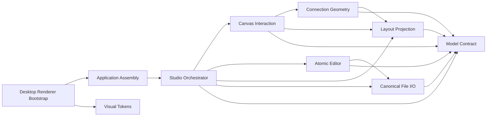

# 系统架构

## 架构原则

Architecture Block Studio 的核心不变量是：`BlockDesignDocument` 是唯一设计事实源。模块、端口、连接、层级、已确认布局和手动 waypoints 都来自这份文档；UI、选择、布局、连线投影、DRC 和文件适配只能消费它，或通过具名 `DesignOperation` 原子更新它。

```text
Menu / Toolbar / Keyboard / Canvas / Inspector
                       │
                       │ DesignOperation
                       ▼
             editor：原子文档变换
                │ success      │ failure
                ▼              ▼
       BlockDesignDocument   可见错误，原文档不变
          │       │       │
          │       │       └──────────► io：解析 / 序列化
          │       └──────────────────► model：Schema / DRC / 图查询
          ├────────► layout：模块与端口坐标
          ├────────► routing：直线投影 / 手动 waypoint 恢复
          └────────► studio/selection：工作区选择
                              │
                              ▼
                    components ─► React Flow
```

依赖从稳定文档契约单向指向派生能力，再由 Studio 组合为产品。组件不能反向定义 Schema、设计语义、文件格式或路由事实。

## 模块与 Owner

| 模块 | 原则与所有权 | 公开接口 | 边界与失败行为 |
| --- | --- | --- | --- |
| `src/model` | 文档结构、Schema、迁移、DRC 和无状态图查询 | `BlockDesignDocument`、`parseBlockDesignDocument`、`validateBlockDesignDocument`、图查询 | 不负责 UI、历史或布局；结构非法时按字段路径拒绝 |
| `src/editor` | 原子文档变换、Undo / Redo、dirty 和设计片段完整性 | `DesignOperation`、`applyDesignOperation`、`useDesignEditor` | 不渲染、不布局、不持久化；失败不产生部分修改 |
| `src/io` | 外部 JSON 与已校验文档之间的转换 | `loadDesignFromObject/Text/File/Url`、`serializeDesign`、`downloadDesign` | 不解释业务，不持有系统路径；加载失败保留当前文档 |
| `src/i18n` | 五种界面语言与本机偏好 | `STUDIO_LOCALES`、`StudioLocaleProvider` | 不翻译用户设计内容，不改 JSON 或 dirty |
| `src/layout` | 从文档和展开状态派生模块、端口、层级与 React Flow 基础边 | `layoutBlockDesign`、布局签名、网格、对齐、分布与组选区几何 | 不持有手势，不修改文档；失败上抛给 Studio |
| `src/routing` | 从当前布局投影自动直线，恢复和规范化用户 waypoint | `projectConnectionRoutes`、`drawRoute`、手动路线编辑纯函数 | 不移动模块、不避障、不持有 Worker 或第二套路由帧；缺少 transient 端点时暂不投影，真实合同错误明确失败 |
| `src/components` | 展示工作台并把鼠标、键盘和菜单动作转换成用户意图 | Canvas、Node、Edge、Tree、Inspector、Dialogs、Dock | 预览和 viewport 是可丢弃状态，不直接深改文档 |
| `src/studio` | 组合公开能力，拥有命令、选择、草稿保护和临时设计剪贴板 | `BlockDesignStudio`、`StudioCommands`、`SelectionRef` | 不重复 Schema、布局、连线或编辑规则 |
| `desktop` | Windows 窗口、原生文件、最近设计、关闭保护和应用内更新 | sandbox preload、具名 IPC、文件与更新服务 | 不解释设计语义；renderer 不获得 Node、任意 IPC 或通用文件系统 |

模块边界由独立职责和变化原因决定，不由文件大小决定。跨模块用例通过公开类型与单用途回调组合，不建立囊括全部能力的全局 Service 或共享可变状态。

## 文档、派生状态与临时状态

| 类别 | 唯一 Owner | 示例 | 是否保存到设计 JSON |
| --- | --- | --- | --- |
| 设计事实 | `BlockDesignDocument` | 模块、端口方向与纵向 `offset`、连接、Level、waypoints | 是 |
| 编辑状态 | Editor | 历史、saved baseline、dirty | 否 |
| 派生结构 | model / layout / routing | DRC、邻接关系、模块坐标、端口锚点、自动直线 | 否 |
| 工作区状态 | Studio / Dock / Canvas | 选择、展开、视图根、面板尺寸、语言、zoom | 否 |
| 手势状态 | 具体交互组件 | 拖动预览、候选端口、框选、对齐线、auto-pan lease | 否 |
| Windows 会话 | Electron main | 当前文件路径、最近设计引用、更新状态 | 否 |

派生数据只能由事实源重新计算，不能反向修改事实。测试和截图验证合同，但不能定义新的业务事实。

## 布局与连线

布局输入只有文档、展开 Level 与 placement mode，输出可重建的 `LayoutResult`。ELK 自动位置是派生结果；只有用户移动、缩放、对齐或分布后的几何才经 Editor 写回 `node.layout`。

接口方向表达调用发起权：连接源必须是调用方的 output，连接目标必须是提供方的 input。参数、返回值与错误同属一个 `InterfaceDefinition`；主动回调、事件或命令必须建立另一条反向 Interface。内部状态所有权和层级包含关系不属于调用，不能伪装成连接。

连线遵守更小的二分合同：

```text
没有 routing.waypoints  -> 当前源/目标端口 -> 两点直线
存在 routing.waypoints  -> Level 原点 + waypoints -> 正交手动折线
```

- 方向只由 `source → target` 决定，不由卡片相对位置猜测。
- 自动线允许交叉、重叠或经过模块；系统不保存隐藏车道、避障结果、线桥或证书。
- 选中线路增强颜色、线宽和中点操作柄，不显示线中标签。
- 自动线第一次拖动或键盘调整会创建手动 waypoints；Reset 删除 waypoints 并恢复两点直线。
- 移动模块、调整尺寸、移动端口和层级展开时，线路只重新读取当前端点坐标。
- 布局 node-first 安装期间，端点未齐的线暂不投影；完整后自然出现，不能伪造坐标或让整个 Canvas 崩溃。

完整合同见 [`ROUTING.md`](ROUTING.md)。

## 端口与直接操作

`layout/nodeGeometry` 是端口锚点和卡片内容安全尺寸的唯一几何 Owner。CSS 只投影相同变量：顶部 Identity、Owner band、端口 Handle 和左右 rail 安全区不能各写一套魔数。左侧只容纳 input，右侧只容纳 output；密集端口可扩大派生卡片，但不能覆盖顶部模块身份或底部 Owner。

外侧圆形 Handle 只创建或重连接口。端口名称是唯一移动入口，其透明命中区通过 `--canvas-inverse-zoom` 保持约 30 个屏幕像素；不会再出现独立移动抓手。端口只能沿逻辑侧纵向移动；input 永远在左，output 永远在右。方向变化由 Editor 同时派生新侧边和安全空位，Canvas 不能单独改 `side`。

拖动期间 `offset` 只是预览，相关线路读取同一份预览端点。松手只提交一次 `port/move`；Escape、pointercancel、窗口失焦或无实际移动都不写文档。

## 选择、命令与视口

`SelectionRef` 是唯一工作区选择协议，区分 document、level、node、port、connection 和 canonical multiple。Canvas、Sources、接口列表、DRC 与 Inspector 只投影这份选择。

- 点击、Shift / Ctrl / Cmd、框选和 Alt 相交框选最终都产生同一选择协议。
- 方向化邻域查询只读取文档的 `source / target`，不读取 DOM 或线路方向。
- Toolbar、Menu、Command Palette、快捷键与对象右键菜单共用 `StudioCommands` 的名称、可用性和执行函数。
- viewport transform 只属于 React Flow；Fit、zoom、pan、MiniMap 和 auto-pan 不进入 JSON 或 History。
- 左键空白框选，Space + 左拖、右拖或中拖平移，Ctrl/⌘ + wheel 围绕指针缩放。
- 选择变化必须经过 Inspector 草稿保护，被拒绝时保持权威选择与文档不变。

## 编辑、历史与文件安全

所有持久修改都是具名 `DesignOperation`。Editor 对当前文档应用操作，Schema / 语义校验通过后才原子替换文档并写入一次历史；失败保持旧文档和旧历史。

加载流程是 parse → migrate → validate → accept。任何阶段失败都不能替换当前文档、清空 dirty 或改变桌面文件绑定。保存使用 canonical serialization；成功后同一字符串成为 saved baseline。

Windows 层通过 sandbox preload 暴露逐项命名的方法。Electron main 只拥有：

- 当前窗口文件绑定；
- `.json` 原生 Open / Save 与原子写入；
- 最多 10 个最近设计的路径引用；
- packaged NSIS 应用的检查、下载和安装更新状态机。

最近记录不复制设计内容；renderer 只获得 opaque id、文件名、目录摘要和时间。应用更新前若任一窗口 dirty 或存在未应用草稿，安装必须停止。

## 源码架构示例与门禁

`scripts/generate-self-architecture.mjs` 是源码事实到示例设计的唯一适配器。真实 TypeScript / TSX / CSS 文件和可解析相对 import 是源事实；脚本中的模块表只拥有责任边界、源码归属和展示位置；生成 JSON 是可重建投影。



门禁保持：

- 每个受管源码文件恰好属于一个责任模块；
- 每条生成依赖都由真实相对 import 支撑，反向也不能漏；
- 依赖图必须无环；
- 示例固定表达五层审查上下文；
- `pnpm verify:self-architecture` 按字节比较投影，漂移时 production build 失败。

当前生成结果覆盖 70 个受管源码文件和 30 条跨模块依赖。

## Schema 兼容策略

当前写出 `BlockDesignDocument 2.3`，读取链可迁移 2.0、2.1 与 2.2。2.3 只接受单向端口，并由 `direction` 唯一派生 `side`：input → left，output → right。2.2 的双向端口只有在连接角色或父子绑定能唯一证明方向时才迁移；无角色或冲突角色会明确失败，不能由 UI 猜测。

手动 waypoints 仍属于连接所在 Level，相邻点必须共享 x 或 y。自动直线不写入 JSON，因此未来改变展示样式不会制造数据迁移。

## 公开嵌入边界

应用层可以通过 URL、本地文件或 Windows 原生文件桥加载同一份 JSON。示例 JSON 只是可替换输入，不是产品内置数据库。嵌入方可以提供初始文档和接收保存结果，但不能跳过解析、迁移、Schema、DRC 和 Editor 原子变换链。
